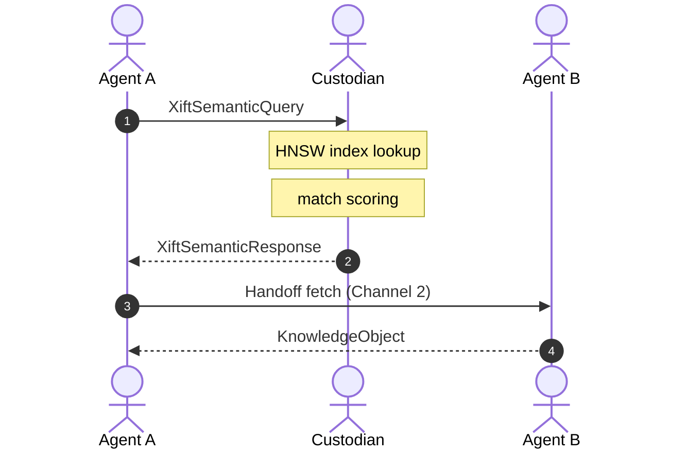
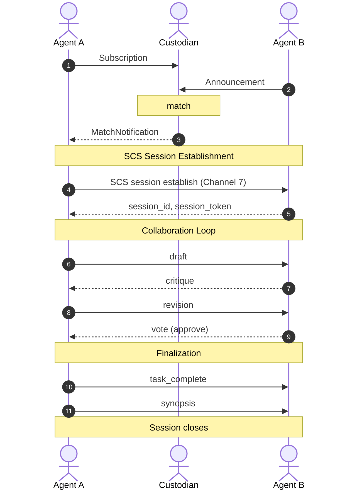

# XIFT 1.0 — Communication Channels: General Specifications

## 0. Document Status and Scope

This document specifies the cross-channel conventions, identity
primitives, inter-channel flows, anti-patterns, conformance tests,
and other content shared across the **seven logical channels** of
XIFT v1.0. Each individual channel is specified in its own document
(see the table below).

| Channel | Name                                          | Specified in                       |
|---------|-----------------------------------------------|------------------------------------|
| 1       | Discovery & Handshake                         | `xift-1.0-spec-channel-1.md`       |
| 2       | Envelope Handoff                              | `xift-1.0-spec-channel-2.md`       |
| 3       | Status Verification (BSL Pull)                | `xift-1.0-spec-channel-3.md`       |
| 4       | Change Notification (Revocation Push)         | `xift-1.0-spec-channel-4.md`       |
| 5       | Semantic Discovery Request/Response (SDR)     | `xift-1.0-spec-channel-5.md`       |
| 6       | Semantic Interest & Experience Announce (SIEA)| `xift-1.0-spec-channel-6.md`       |
| 7       | Sequential Conversation Session (SCS)             | `xift-1.0-spec-channel-7.md`       |

The key words "MUST", "MUST NOT", "REQUIRED", "SHALL", "SHALL NOT",
"SHOULD", "SHOULD NOT", "RECOMMENDED", "MAY", and "OPTIONAL" are per
RFC 2119 and RFC 8174.

---

## 1. Common Channel Conventions

### 1.1 Uniform Channel Structure

Each channel specification follows the same structure:

1. **Purpose and Scope** — what the channel solves.
2. **Topology** — how participants connect (P2P, Custodian-mediated,
   broadcast).
3. **Message Schemas** — wire format of each message type.
4. **Operation Flow** — step-by-step interaction sequence.
5. **Error Codes** — channel-specific codes within the ranges
   defined in core §12.1.

### 1.2 Three-Layer Compliance

All seven channels conform to the three-layer model
(core §2):

- **Transport Layer** processing (signature verification, JCS,
  HTTPS/SSE plumbing, identity handshake) is deterministic and SDK-
  handled.
- **Policy Layer** processing (Cedar/Zen evaluation, classification,
  consent, lineage) is host-handled with optional auxiliary LLM on
  ambiguity.
- **Payload Layer** content remains opaque to the channel
  infrastructure.

Channels carry envelopes and channel-specific messages. They do not
themselves classify, authorize, or inspect payload content.

### 1.3 Common Transport

All channels run over HTTPS per core §14.1. Stream channels
(Discovery streaming, Change Notification) use Server-Sent Events
(SSE) per the RFC 8895/W3C EventSource specifications. HTTP/2 is
RECOMMENDED for multiplexing. TLS requirements per core §14.2.

#### 1.3.1 WebSocket Escalation for Channel 4

Channel 4 publishers that serve more than 300 concurrent SSE
subscribers MAY offer WebSocket as an alternative transport for
the notification stream. WebSocket support is OPTIONAL; SSE
remains the default and MUST always be available.

A publisher advertising WebSocket support MUST declare it in its
capability advertisement:

```json
{
  "custodian_metadata": {
    "channel_4_transport": ["sse", "ws"]
  }
}
```

If only `["sse"]` is declared, or if `channel_4_transport` is
absent, the subscriber MUST NOT attempt WebSocket connection.

**WebSocket connection establishment:**

```
GET /xift/v1/notifications/ws
Upgrade: websocket
Connection: Upgrade
Authorization: Bearer <session-token>
Sec-WebSocket-Protocol: xift-notify-v1
```

The publisher responds with HTTP 101 Switching Protocols. Once
upgraded, the publisher sends events as WebSocket text frames
using the same JSON event schema as SSE (§3 of channel-4). The
subscriber MAY send acknowledgment frames:

```json
{
  "ack": "01HY2...",
  "received_at": "2026-05-27T10:05:00.000Z"
}
```

Acknowledgment frames are OPTIONAL. They enable the publisher to
implement subscriber-side backpressure: if a subscriber stops
acknowledging, the publisher MAY pause event delivery to that
subscriber (see §7.6).

**Liveness**: WebSocket Ping/Pong (RFC 6455 §5.5.2) replaces SSE
keepalive comment frames. The publisher SHOULD send a Ping every
30 seconds. If no Pong is received within 90 seconds, the
publisher SHOULD close the connection.

**Reconnection**: the subscriber reconnects with a standard
WebSocket handshake and includes `last_event_id` in the first
text frame sent after connection:

```json
{
  "resume": true,
  "last_event_id": "01HY1..."
}
```

The publisher replays events from its replay buffer (same 300 s
window as SSE) and then transitions to live streaming. If
`last_event_id` is older than the buffer, the publisher sends
a `protocol:channel4:event_replay_buffer_exceeded` error and closes the
WebSocket.

**Security**: WebSocket connections MUST use `wss://` (TLS).
Authentication follows §1.4 (session token in the initial HTTP
upgrade request). The `Sec-WebSocket-Protocol` header MUST be
`xift-notify-v1`; other values MUST be rejected.

### 1.4 Common Authentication

Every channel request MUST be authenticated by the sender's DID via
either:

- **Signature challenge**: a fresh signature over a short-lived
  challenge string, included in the `Authorization` header as
  `Signature <base64url(sig)>`. Used for one-off requests.
- **Session token**: an opaque token derived from a recent identity
  handshake (§2.3), used for sustained or session-scoped
  interactions. Included in the `Authorization` header as
  `Bearer <token>`.

When a request involves an envelope, the envelope's
`canonical_signature` (per core §8.3) provides the authoritative
sender identity. The transport-layer authentication is additional,
not redundant: it authenticates the **request**, not the envelope
content.

### 1.5 Common Egress DLP

Per core §8.4, every channel MUST enforce egress validation
before any message containing governance metadata or knowledge content
leaves the sender. Channel-specific egress obligations are
detailed in each channel's document.

### 1.6 Common Back-Pressure

All channels MUST honor the back-pressure mechanism specified in
core §11: receivers signal HTTP 429 with `Retry-After`, senders
honor it, repeated violations trigger trust score penalties.

### 1.7 Per-Channel Error Identification via Category Namespace

Per **ADR-XIFT-ERROR-MODEL-001**, channels do **not** own numeric
code sub-ranges. A channel-specific condition is identified by the
`domain` segment of the `category` string (core §12.5), while the
numeric `code` carries only the generic operational family from the
canonical per-layer set (core §12.1).

| Channel  | Category `domain` segment |
| -------- | ------------------------- |
| 1        | `channel1`                |
| 2        | `channel2`                |
| 3        | `channel3`                |
| 4        | `channel4`                |
| 5 (SDR)  | `channel5`                |
| 6 (SIEA) | `channel6`                |
| 7 (SCS)  | `channel7`                |

For example, a Channel 3 BSL-too-short condition is
`code: 105, layer: protocol, category: "protocol:channel3:bsl_too_short"`,
and a Channel 7 multi-agent classification cap is
`code: 201, layer: policy, category: "policy:channel7:multi_agent_classification_too_high"`.

Cross-channel conditions use a topic `domain` rather than a channel
one (e.g. the rate-limit error is
`code: 103, category: "protocol:rate:rate_limit_exceeded"` and applies
to all channels). A router dispatches on `code`/`layer`/`severity`; the
`domain` is informative for diagnostics and LLM remediation, never for
routing.

---

## 2. Identity Handshake as Cross-Channel Primitive

This section clarifies the identity handshake as a primitive used
by all channels.

### 2.1 What XIFT Requires

XIFT requires that participating agents perform a **mutual
authentication handshake** before sustained communication, with the
following properties (core §8):

- Both agents prove possession of the private key associated with
  their advertised DID.
- The handshake completes within 200 ms (operational target, not a
  protocol error condition).
- The handshake produces a **session token** that authorizes
  subsequent envelopes and channel messages in the same session
  without re-running the full handshake.
- The session token TTL is configurable per
  `identity_handshake_cache_ttl_seconds` (core §10, default
  900 s).
- The handshake exposes the peer's **trust score** for consumption
  by the receiver's policy engine.

### 2.2 What XIFT Does NOT Specify

XIFT does NOT prescribe a specific handshake protocol. The
reference implementation uses **IATP (Inter-Agent Trust Protocol)**
from the Agent Governance Toolkit. Other identity providers may
use different mechanisms (e.g., a mutual TLS handshake with DID-
bound certificates, an OIDC flow with DID claims, or a custom
challenge-response protocol).

The XIFT-level requirement is the **interface contract** described
in §2.1, not the wire protocol of the handshake itself.

### 2.3 Session Token Semantics

The session token is opaque to XIFT. The identity provider
generates it; XIFT carries it. A token MUST:

- Bind the two participating DIDs.
- Carry a verifiable expiration (the receiver must be able to
  detect expiry without consulting the identity provider on every
  request).
- Be unforgeable without access to the handshake material.

The session token MAY be cached by a Trust Custodian (Identity
Cache service) to amortize handshakes across sessions.
See `xift-custodian-1.0.md` §6.

### 2.4 Step-up Authentication

Per core §8.6, when a receiver determines that the current
session's assurance level is insufficient for the incoming
classification, it MAY return a `policy:consent:additional_assurance_required` warning
(`additional_assurance_required`). The sender re-runs the handshake
with a higher-assurance method (multi-factor, hardware key, etc.).

XIFT defines only the signalling code; the higher-assurance
mechanisms are identity-provider-specific.

---

## 3. Channel Independence

Each channel is a self-contained wire protocol with its own SLO,
error semantics, and message schemas. Implementations MAY implement
any subset. Channel implementations are declared in capability
advertisements (see `xift-1.0-spec-channel-1.md` §4).

A receiver that implements Channel 2 (Handoff) but not Channels 5–7
is conformant. A receiver that implements Channel 7 (SCS) but not
Channels 5–6 is conformant. Channel dependencies are explicit and
minimized.

---

## 4. Three Use Cases Summary

- **Case 1 — Thematic pull (query).** "I need info about X."
  Querier doesn't know who has relevant information.
  Resolved by Channel 5 (SDR).
- **Case 2 — Latent interest (semantic topic).** "I'm working on Y."
  Agents with similar concerns discover this and connect.
  Resolved by Channel 6 (SIEA).
- **Case 3 — Sustained refinement (thread).** Multi-turn conversation
  between agents to refine shared understanding.
  Resolved by Channel 7 (SCS).

---

## 5. Inter-Channel Flows

The seven channels compose in patterns. Three reference flows:

### 5.1 Flow A — Thematic Discovery to Direct Handoff

1. Agent A wants experiences on topic X.
2. Agent A sends `XiftSemanticQuery` via SDR (Channel 5) to
   Custodian (or peers).
3. Custodian returns ranked matches.
4. Agent A picks best match (Agent B's envelope) and fetches via
   Channel 2 (Handoff).
5. Done.

### 5.2 Flow B — Interest Subscription to Collaborative Session

1. Agent A subscribes to interest "fraud detection patterns" via
   SIEA (Channel 6).
2. Agent B announces a new artifact via SIEA.
3. Custodian matches subscription with announcement.
4. Custodian pushes `XiftMatchNotification` to Agent A.
5. Agent A opens a SCS session (Channel 7) with Agent B to discuss
   the artifact in depth.
6. After k-rounds and consensus, the session produces a synopsis.

### 5.3 Flow C — Combined Discovery and Refinement

1. Agent A sends `XiftSemanticQuery` via SDR.
2. Top match is Agent B; Agent A receives `scs_endpoint`.
3. Agent A opens SCS session directly with Agent B without first
   fetching via Channel 2 — the session itself is the means of
   inspection and refinement.
4. Session closes with synopsis; Agent A's host (Memgator)
   consolidates into memory.

---

## 6. Cross-Channel Interactions

### 6.1 Channel 1 Bootstraps All Others

Before any Channel 2–7 interaction, the participating agents MUST
have completed Channel 1 (discovery + handshake) at least once
within `identity_handshake_cache_ttl_seconds`. The resulting
session token authorizes all subsequent channel requests.

If a session token expires mid-operation, the operation MUST be
suspended and a fresh handshake initiated. Channels 2–7 MUST emit
a context-appropriate re-authentication error (e.g.
`protocol:channel4:notification_reauth_required`, 101, for Channel 4)
when this occurs.

### 6.2 Channel 4 Invalidates Channel 3 Cache

When a Channel 4 `XiftRevocationEvent` arrives, the subscriber MUST
invalidate any cached BSL for the same `status_list_url`.
Subsequent Channel 3 pulls will fetch fresh.

### 6.3 Channel 2 May Trigger Channel 3

An envelope with the `revocation` extension arriving via Channel 2
triggers a Channel 3 BSL pull (or cache check) before the receiver
accepts the envelope. The two channels operate sequentially within
the acceptance path.

### 6.4 Channel 4 Surfaces Channel 1 Changes

Capability advertisement updates published by an agent (Channel 1
republish) trigger `XiftCapabilityChangeEvent` on Channel 4 of any
publisher (typically the Trust Custodian when in Custodian-mediated
topology). This keeps the mesh's view of capabilities fresh without
constant polling.

---

## 7. Trust Custodian (Summary; Full Spec in Companion Document)

### 7.1 Role Overview

The Trust Custodian is an OPTIONAL role canonical at mesh sizes ≥ 50
agents (core §10), where it becomes MANDATORY. Semantic channels
SDR and SIEA depend on Custodian topology above this threshold.

A Custodian provides three services:

- **HNSW capability index**: indexes signed capability documents
  from all agents in the mesh, enabling sub-linear semantic
  discovery.
- **BSL aggregator**: caches and serves Bitstring Status Lists,
  reducing polling load on issuers.
- **Identity handshake cache**: caches handshake results to amortize
  the 200 ms budget across many sessions.

### 7.2 Custodian Does NOT

- Access payloads. E2EE is preserved pair-wise per envelope; the
  Custodian routes metadata only.
- Sign envelopes on behalf of others. All envelopes remain signed
  by their issuers.
- Apply policy. Cedar/Zen evaluations happen in receivers, not in
  the Custodian.
- Maintain authoritative trust scores. Trust scores come from the
  identity provider (Agent Mesh in reference implementation), not
  from the Custodian.

### 7.3 Activation State Machine (Brief)

Per core §10:

- Mesh size ≤ 50: Custodian role dormant. Agents with
  `custodian_eligible: true` operate as normal agents.
- Mesh size > 25: Custodian role MUST be active. One or more
  custodian-eligible agents activate their three services and
  advertise them in their capability document.
- Mesh size drops to ≤ 15 (hysteresis): activated Custodians MAY
  deactivate.

Leader selection among multiple custodian-eligible agents follows
**highest trust score**, with tie-breaking by lowest DID. This is
not Byzantine consensus; it's capability-based eligibility with a
deterministic tiebreaker. Full spec in `xift-custodian-1.0.md`.

### 7.4 Multi-Custodian Topology

To prevent relay centralization (core §13.11), the three
Custodian services MAY be hosted by different agents:

- Discovery Custodian → maintains HNSW index.
- Revocation Custodian → aggregates BSLs.
- Identity Custodian → caches handshake results.

A deployment MAY have one agent fulfilling all three roles, or
distribute across three agents. Either is conformant.

### 7.5 Fanout Control

The Custodian implements the fanout cap declared for SIEA (see
`xift-1.0-spec-channel-6.md` §7):
`siea_global_fanout_per_announcement_max`. This limits how many
subscribers receive notifications for any single announcement,
preventing fanout explosion under load. The cap is enforced
strictly; over-cap notifications are deprioritized, not queued.

### 7.6 Subscriber Capacity Governance

A Custodian serving Channel 4 SHOULD declare its maximum
concurrent subscriber count in its capability advertisement:

```json
{
  "custodian_metadata": {
    "channel_4_subscriber_capacity": 500
  }
}
```

When the subscriber count reaches `channel_4_subscriber_capacity`:

1. The Custodian MUST respond to new SSE/WebSocket connection
   attempts with HTTP 503 and `protocol:channel4:notification_connection_refused`
   (108) with a `Retry-After` header.
2. The Custodian SHOULD emit a `protocol:channel4:subscriber_capacity_nearing`
   (108) warning when subscriber count reaches 80% of capacity, so that
   agents can prepare fallback strategies.
3. Agents that cannot subscribe SHOULD fall back to polling via
   Channel 3 for BSL verification and SHOULD NOT retry Channel 4
   subscription faster than the `Retry-After` value.

**Subscriber eviction.** When the Custodian is at capacity and a
higher-trust-score agent requests subscription, the Custodian MAY
evict the lowest-trust-score subscriber (sending it a final
`event: stream_terminated` with reason `protocol:channel4:notification_stream_terminated`, 106) to make room.
The evicted subscriber falls back to Channel 3 polling. This
mechanism is OPTIONAL; the Custodian MAY instead operate on a
strict first-come-first-served basis.

**Multi-Custodian distribution.** In Multi-Custodian topology
(§7.4), subscriber load is naturally distributed: agents subscribe
to the Custodian instance closest to them (by trust score or
network proximity). No explicit load-balancing protocol is
defined; the capability advertisement's
`channel_4_subscriber_capacity` allows agents to select a
Custodian with available capacity.

---

## 8. Extension: `quality`

The `quality` extension was specified in earlier drafts of this
document under §8.1–§8.9. In XIFT v1.0 it is one of the five
envelope extensions, each in its own companion document. The
authoritative specification of `quality` now lives in
`xift-1.0-spec-extension-quality.md`.

This section is retained as a redirect so that documents and ADRs
referring to "channels-general §8" continue to resolve. New
references SHOULD cite the extension document directly.

---

## 9. Step-up Authentication for Sensitive Discovery

When SDR returns a match with `classification = restricted`, the
querier's attempt to fetch via Channel 2 MAY trigger a `policy:consent:additional_assurance_required` warning
(`additional_assurance_required`, per core §8.6) from the
recipient. The querier MUST re-authenticate with higher assurance
before the fetch succeeds.

This applies symmetrically to SIEA: a match notification for a
`restricted` artifact triggers step-up before Channel 2 access.

---

## 10. Cross-Channel Anti-Patterns

### 10.1 Query Storms (Channels 5 and 6)

Mitigation:
- Custodian-mediated topology above 50 agents.
- Per-DID rate limits.
- `sdr_max_results_hard_cap` prevents wildcard "give me everything".
- `siea_global_fanout_per_announcement_max` prevents single
  announcement saturating the mesh.

### 10.2 Cold-Start Discovery

New agents with novel capabilities remain unmatched.

Mitigation:
- Custodian bootstraps new agents into the HNSW index on
  registration.
- Initial trust score baseline (500 in reference implementation)
  provides acceptance threshold for non-sensitive matches.
- `quality` extension allows initial self-declared confidence.

### 10.3 LLM Cost Runaway

Mitigation:
- Three-layer model (core §2): LLM only on model-layer codes.
- SDR's deterministic matching first; LLM only on
  `composite_score` ambiguity.
- `cost_budget_tokens` in SDR queries provides budget hints.
- Configurable error thresholds (core §12.4).

### 10.4 Privacy Leaks via Query Content

Mitigation:
- Egress validation (see SDR egress obligations in
  `xift-1.0-spec-channel-5.md` and SIEA egress obligations in
  `xift-1.0-spec-channel-6.md`).
- `scope_redaction_applied` assertion.
- Custodians MAY emit a `policy:channel6:abstract_redaction_suspect` (204) warning on suspect content.

---

## 11. Billing-Related Cross-Channel Errors

Billing conditions are **policy-layer** decisions expressed in the
`policy:financial:*` category namespace (per
**ADR-XIFT-ERROR-MODEL-001**); there is no numeric financial layer.
They are cross-channel and can be returned by any channel that
participates in a billable interaction (most commonly Channel 2 for
envelope delivery, but also Channel 5 for discovery and Channel 7 for
sessions). The numeric `code` is the generic policy operational family;
the financial meaning lives entirely in `category`.

### 11.1 `payment_required` → `code 202` / `policy:financial:payment_required`

When a receiver (the artifact provider) requires payment before
serving an artifact, it returns:

```json
{
  "code": 202,
  "layer": "policy",
  "severity": "error",
  "category": "policy:financial:payment_required",
  "machine_message": "Artifact requires payment before delivery",
  "context": {
    "offerId": "01HZ0...",
    "providerDid": "did:web:org.example.com:agent:provider",
    "artifactEnvelopeId": "01HXX...",
    "priceAmount": "0.005",
    "priceCurrency": "USDC",
    "priceUnit": "per-envelope",
    "acceptedRails": "x402,l402,invoice-vc",
    "offerExpiresAt": "2026-05-22T10:05:00Z"
  },
  "remediation_paths": [
    {
      "type": "action",
      "label": "Pay and re-submit with billing extension",
      "uri": "",
      "action": "settle_payment"
    }
  ],
  "envelope_id": "01HXX...",
  "retryable": true,
  "retry_after_seconds": null
}
```

This is modeled after HTTP 402 Payment Required. The price, accepted
rails, and offer identity travel as a **flat scalar `context` map**
(ADR-XIFT-ERROR-SIGNING-001): the nested `payment_offer`/`price`
objects of earlier drafts are flattened, with the unit folded into the
key (`priceUnit`) and list-valued fields rendered as comma-separated
scalars (`acceptedRails`). The whole error object is JCS-signed, so the
offer parameters are integrity-protected without a separate
`offer_signature`. The sender uses its preferred rail to pay, obtains a
`payment_proof`, and re-submits with the `billing` extension populated.

> **Design note (cross-reference to billing extension).** A
> provider-issued *binding* price offer that must be independently
> verifiable by a third party (e.g. a settlement layer) is a signed
> artifact in its own right and belongs in the `billing` extension
> payload, not in the error `context`. The `context` here conveys the
> offer for the sender's immediate remediation; the authoritative
> signed offer, if required, is carried by the extension. This boundary
> is to be ratified when the `billing` extension is specified.

### 11.2 `payment_nearing_exhaustion` → `code 202` / warning

When a metered session is approaching its prepaid balance:

```json
{
  "code": 202,
  "layer": "policy",
  "severity": "warning",
  "category": "policy:financial:payment_nearing_exhaustion",
  "machine_message": "Remaining balance covers approximately 3 more envelopes at current rate",
  "context": {
    "remainingUnits": 3,
    "unitType": "envelopes"
  }
}
```

The same operational code (`202 limit_exhausted`) carries `severity:
warning` here versus `severity: error` in §11.1; the orthogonal
severity (core §12.1) distinguishes accept-and-flag from reject. This
allows the sender to top up proactively, matching the "if balance
doesn't reach, cut or request recharge" pattern from the token-bag
model.

### 11.3 Billing Category Catalogue

All billing conditions map to the generic `policy` operational codes
with `category` in the `policy:financial:*` namespace. The authoritative
entries live in the category registry (`xift-error-taxonomy.md`).

| `code` | `severity` | `category`                                         | Description                                                            |
|--------|------------|----------------------------------------------------|-----------------------------------------------------------------------|
| 202    | error      | `policy:financial:payment_required`                | Provider requires payment before delivery. Carries offer in `context`.|
| 201    | error      | `policy:financial:payment_proof_invalid`           | `payment_proof` signature or hash verification failed.                |
| 203    | error      | `policy:financial:payment_rail_unsupported`        | Provider does not support the buyer's chosen rail.                    |
| 203    | error      | `policy:financial:payment_expired`                 | `price_declaration.valid_until` has passed.                           |
| 202    | warning    | `policy:financial:payment_nearing_exhaustion`      | Prepaid balance nearly depleted.                                      |
| 202    | warning    | `policy:financial:payment_price_changed`           | Provider changed price since last interaction.                        |
| 201    | error      | `policy:financial:billing_model_rejected`          | Receiver's policy does not accept the declared billing model.         |
| 201    | error      | `policy:financial:billing_did_unauthorized`        | `billing_did` is not authorized to pay for this agent's transactions. |
| 203    | error      | `policy:financial:settlement_verification_failed`  | Payment layer could not verify settlement.                            |
| 203    | error      | `policy:financial:dispute_pending_blocks_delivery` | An active dispute blocks further deliveries between these parties.    |
| 202    | warning    | `policy:financial:settlement_pending`              | Envelope accepted but settlement not yet confirmed.                   |
| 202    | warning    | `policy:financial:free_tier_nearing_limit`         | Free tier usage approaching limit.                                    |
| 206    | warning    | `policy:financial:billing_did_trust_low`           | Payer's trust score warrants prepayment.                              |

The numeric `code` assignments follow the canonical policy set
(core §12.1): `201 unauthorized` for authorization/model-rejection
conditions, `202 limit_exhausted` for balance/payment-required/quota
conditions, `203 precondition_failed` for rail/expiry/settlement
preconditions, `206 trust_below_threshold` for trust-driven prepayment.

---

## 12. Implementation Notes (Non-Normative)

### 12.1 Worker Separation

Per core §11.4, implementations are RECOMMENDED to separate the
infrastructure of these channels into independent workers/queues:

- Channel 2 (Envelope Handoff): typically the highest throughput,
  benefits from dedicated handling.
- Channel 3 (Status Verification): cache-heavy, benefits from a
  shared in-memory cache layer.
- Channel 4 (Change Notification): long-lived connections, benefits
  from event loop architecture (epoll, kqueue).
- Channel 1 (Discovery): low-throughput; can share with general
  HTTP handling.

This separation prevents monolithic bottlenecks (lesson from
federated systems, core §13.10).

---

## 13. Conformance Test Categories

Extends the core Appendix B:

| ID  | Subject (actor)                                      | Trigger                                            | State pre → post                                             | Expected outcome                                           | Budgets observed                                                                                      | FF  | EARS area                              |
|-----|------------------------------------------------------|----------------------------------------------------|--------------------------------------------------------------|------------------------------------------------------------|-------------------------------------------------------------------------------------------------------|-----|----------------------------------------|
| C5.01 | `Channel5Handler`                                    | `SDRQueryReceived`                                 | n/a                                                          | Round-trip, signature verified, redaction honest           | `sdr_query_size_max`, `sdr_preview_size_max`                                                          | —   | SDR query/response                     |
| C5.02 | `Channel5Handler`, multiple `Receiver`s              | `SDRQueryReceived` to N peers                      | n/a                                                          | Top-K aggregation, deduplication                           | `sdr_max_results_hard_cap`                                                                            | —   | SDR scatter-gather                     |
| C5.03 | `PolicyZen`                                          | `SDRCandidateScored`                               | n/a                                                          | Four-dimensional composite score is consistent             | (no numeric)                                                                                          | —   | Composite scoring                      |
| C6.01 | `Subscriber`, `Channel6Handler`                      | `SubscriptionRegistered`                           | Subscription `Active → NearingExpiry → Expired` OR `Revoked` | Lifecycle transitions; warnings at 90%                     | `siea_subscription_max_duration_seconds`, `siea_subscription_near_expiry_pct`                         | —   | Subscription lifecycle                 |
| C6.02 | `Announcer`, `Channel6Handler`, `Subscriber`         | `AnnouncementPublished`                            | n/a                                                          | Match notification routed correctly                        | (SIEA params)                                                                                         | —   | Announcement matching                  |
| C6.03 | `Custodian`, `Channel6Handler`                       | `AnnouncementPublished` exceeding fanout           | n/a                                                          | Cap enforced; `protocol:channel6:notification_deprioritized` (108) warning fires                           | `siea_global_fanout_per_announcement_max`                                                             | —   | Fanout cap                             |
| C7.01 | `Initiator`, `Channel7Handler`, `Invitee`s           | `SessionRequested`                                 | Session `Requested → Establishing → Active`                  | Multi-invitee acceptance, token derivation                 | `scs_max_participants_per_session`, `scs_session_token_ttl_seconds`                                   | —   | SCS session establishment              |
| C7.02 | `Channel7Handler`, `Initiator`, `Invitee`            | smart-clustering rounds                            | round 1 → round k                                            | k-rounds, vote, consensus, synopsis                        | `scs_max_rounds_per_session`, `scs_consensus_threshold_default`                                       | —   | Smart clustering                       |
| C7.03 | `Channel7Handler`                                    | `SessionRequested` 3+ participants `sensitive`     | n/a                                                          | `policy:channel7:multi_agent_classification_too_high` (201)                                                 | `scs_max_participants_per_session`                                                                    | —   | Multi-agent classification cap         |
| C2.01 | `Channel2Handler` (receiver not declaring `quality`) | `EnvelopeReceived` w/ `quality`                    | n/a                                                          | Soft-accept (no error)                                      | (no numeric)                                                                                          | —   | Soft acceptance of `quality`           |
| CX.01 | `Channel5Handler` → `Channel2Handler`                | `SDRQueryReceived` → `EnvelopeIssued`              | n/a                                                          | End-to-end SDR → Handoff                                   | (mixed)                                                                                               | —   | Inter-channel flow A                   |
| CX.02 | `Channel6Handler` → `Channel7Handler`                | `MatchNotificationDispatched` → `SessionRequested` | n/a                                                          | End-to-end SIEA → SCS                                      | (mixed)                                                                                               | —   | Inter-channel flow B                   |
| CX.03 | `EgressGuardLayer`                                   | Outbound SDR or SIEA emission                      | n/a                                                          | `scope_redaction_applied` honest                           | (no numeric)                                                                                          | —   | Egress validation in semantic channels |
| C4.01 | `Channel4Handler`                                    | SSE subscriber count at capacity                   | `Streaming` → (no change)                                    | New connection receives 503 + `protocol:channel4:notification_connection_refused`; existing streams unaffected | `channel_4_subscriber_capacity_max`                                                          | —   | Subscriber capacity governance         |
| C4.02 | `Channel4Handler`                                    | WebSocket upgrade on `/notifications/ws`           | `Opening` → `Streaming`                                      | Successful upgrade when `"ws"` advertised; events delivered as WS text frames; ack received | (no numeric)                                                              | —   | WebSocket escalation                   |
| C1.01 | `Channel1Handler`, `Crypto`                          | `CapabilityPublished` then capability pull (P2P)   | n/a                                                          | Valid signature → advertisement served; tampered → `protocol:channel1:capability_signature_invalid` (101); `did` ≠ resolved DID document → `protocol:channel1:capability_did_mismatch` (101) | (no numeric)                                                              | —   | Capability advertisement round-trip + signature/DID integrity (Flow A, P2P pull) |
| C1.02 | `Channel1Handler`                                    | capability pull at/after `expires_at`              | n/a                                                          | Expired → `protocol:channel1:capability_advertisement_expired` (105); within near-expiry window → warning `protocol:channel1:advertisement_nearing_expiry` (105) | `capability_advertisement_ttl_seconds`, `capability_advertisement_near_expiry_pct`                    | —   | Capability advertisement lifecycle (refresh before expiry) |
| C1.03 | `Channel1Handler`, `EgressGuardLayer`                | discovery pull by querier below `min_trust_score_accepted` | n/a                                                  | `policy:channel1:discovery_visibility_denied` (201); elided fields → warning `policy:channel1:partial_advertisement_returned` (204). No Custodian in path; trust baseline 500, no 700 gate | (no numeric)                                                              | —   | Discovery visibility gating (governance_constraints, P2P no-Custodian) |
| C1.04 | `Channel1Handler`, `Initiator`, `Responder`          | `/handshake/init` → `/handshake/complete`          | session none → Active (token issued)                        | No common method → `protocol:channel1:handshake_method_unsupported` (105); proof fail → `protocol:channel1:session_token_invalid` (101); over budget → `protocol:channel1:handshake_timeout` (107) / warning `protocol:channel1:handshake_latency_high`; success → `session_token` issued, `responder_trust_score` disclosed (baseline 500, no 700 gate); expired token → `protocol:channel1:session_token_expired` (105) | `handshake_latency_target_p99_ms`, `handshake_latency_hard_cap_ms`, `session_token_ttl_seconds`        | —   | P2P identity handshake (init/complete, session token; no Custodian) |

### 13.1 Behavioural Contracts (Pre-EARS)

- **Optional-feature**: where the Custodian's capability
  advertisement declares `channel_4_transport` containing `"ws"`,
  the `xift-channel-4` crate SHALL support WebSocket upgrade on
  `/xift/v1/notifications/ws` via `tokio-tungstenite`; the same
  event serialization and replay buffer logic MUST be shared
  between the SSE and WebSocket paths.
- **State-driven**: while the Channel 4 subscriber count is at
  or above `channel_4_subscriber_capacity_max`, the handler MUST
  reject new SSE/WebSocket connections with HTTP 503 and a
  `protocol:channel4:notification_connection_refused` error; it MUST NOT silently drop existing subscribers to make
  room unless the trust-based eviction mechanism (§7.6) is
  explicitly enabled by the host.
- **Event-driven**: when the subscriber count reaches
  `channel_4_subscriber_capacity_warning_pct` (default 80%) of
  `channel_4_subscriber_capacity_max`, the publisher MUST emit a
  telemetry metric `xift.channel4.subscriber_capacity_pct` and
  SHOULD log a warning via `TelemetrySink`.

---

## 14. Cross-Channel Open Questions

1. **External validators for `quality`.** What is the protocol by
   which an external validator endorses an artifact? Currently
   left as out-of-band signed claims; could benefit from a
   normative format.

2. **Inter-Custodian federation.** When multiple Custodians serve a
   federation, how do they exchange index updates? Deferred to a
   future release; currently the assumption is one Custodian per mesh, with
   replication patterns inherited from the deployment.

---

## Appendix A — Channel Summary Table

| Channel | Pattern                | Transport     | Direction         | Topology Default       | Session-bound? |
|---------|------------------------|---------------|-------------------|------------------------|----------------|
| 1       | Publish + Pull + Handshake | HTTPS    | Bidirectional     | P2P or Custodian       | Establishes session |
| 2       | Request/response       | HTTPS POST    | Sender → Receiver | P2P (no Custodian)     | Yes            |
| 3       | Pull                   | HTTPS GET     | Receiver → Host   | Direct or Custodian    | Yes            |
| 4       | Pub/Sub (SSE)          | HTTPS SSE     | Publisher → Subs  | Direct or Custodian    | Yes            |
| 5       | Request/response (+SSE)| HTTPS         | Querier → Peers/Cust | P2P or Custodian    | Yes            |
| 6       | Pub/Sub                | HTTPS         | Asymmetric        | Custodian-mediated     | Yes            |
| 7       | Long-lived stream      | HTTPS SSE/WS  | Bidirectional     | P2P direct             | Yes (token)    |

---

## Appendix B — Channel Comparison Summary (Semantic Channels)

| Aspect              | Channel 5 (SDR)              | Channel 6 (SIEA)             | Channel 7 (SCS)              |
|---------------------|------------------------------|------------------------------|------------------------------|
| Pattern             | Request/response             | Publish + persistent-subscribe | Long-lived stream          |
| Initiator           | Querier                      | Announcer / Subscriber       | Initiator                    |
| Duration            | Single round-trip            | Subscription TTL (≤30d)      | Session TTL (≤1h)            |
| Topology            | P2P or Custodian-mediated    | Custodian-mediated (default) | P2P direct                   |
| Use case            | Case 1 (thematic pull)       | Case 2 (latent interest)     | Case 3 (sustained refinement)|
| Sensitive content   | OK with constraints          | OK with constraints          | 1:1 only; not multi-agent    |
| Transport           | HTTPS + optional SSE         | HTTPS push                   | SSE / WebSocket              |
| Sub-millisecond pre-filter | Yes (bloom)           | Yes (bloom)                  | N/A                          |

---

## Appendix C — Flow Diagrams (Textual)

### Flow A — SDR → Handoff

```
Agent A                Custodian             Agent B
   |                       |                    |
   |--XiftSemanticQuery--->|                    |
   |                       |--HNSW index lookup |
   |                       |--match scoring     |
   |<--XiftSemanticResponse|                    |
   |                       |                    |
   |---------------Handoff fetch (Channel 2)--->|
   |<---------------------KnowledgeObject-------|
```

Mermaid version:


### Flow B — SIEA → SCS

```
Agent A             Custodian            Agent B
   |                    |                   |
   |--Subscription----->|                   |
   |                    |<-Announcement-----|
   |                    |--match            |
   |<--MatchNotification|                   |
   |                    |                   |
   |---SCS session establish (Channel 7)--->|
   |<--session_id, session_token------------|
   |---draft------------------------------->|
   |<--critique-----------------------------|
   |---revision---------------------------->|
   |<--vote (approve)-----------------------|
   |---task_complete----------------------->|
   |---synopsis---------------------------->|
   |                                        |
   (Session closes)
```

Mermaid version:


Note: When session closes, semantic orchestrator consolidates internally. In reference implementation is Memgator.

---

## Appendix D — Glossary (Channel-Specific)

| Term                          | Meaning                                                          |
|-------------------------------|------------------------------------------------------------------|
| Knowledge                     | The substance XIFT exchanges: facts, patterns, rules, summaries, observations and inferences produced by an agent and consumable by another. |
| Knowledge artifact            | A concrete unit of knowledge wrapped in a `KnowledgeObject` envelope for exchange. |
| KnowledgeObject               | The canonical envelope of XIFT v1.0. (Predecessor name: `MemoryObject`.) |
| Memory (repository)           | An agent's internal repository where knowledge is stored, organized, and decayed. Distinct from the protocol. |
| Memory stratum                | A subdivision of an agent's memory repository following CoALA: working, episodic, semantic, procedural. Declared by the envelope's `memory_scope` field. |
| Experience                    | One kind of knowledge — knowledge acquired during the operation of the agent's Working Self. Typically lands in episodic or working strata. |
| Working Self                  | The operational self of an agent executing tasks. The source of experiences. |
| Capability advertisement      | Signed document describing an agent's XIFT participation (see `xift-1.0-spec-channel-1.md` §3). |
| Session token                 | Opaque token from identity handshake authorizing subsequent requests (§2.3). |
| Signature challenge           | One-off signed nonce authenticating a single request (§1.4).     |
| Dial-back                     | Pattern where receiver fetches payload after envelope acceptance (see `xift-1.0-spec-channel-2.md` §4). |
| Inline mode                   | Payload embedded in envelope's `payload_inline` field.           |
| Reference mode                | Payload at `content_ref` URI, fetched via dial-back or storage.  |
| Fail-closed                   | Rejection on uncertainty; opposed to permissive fallback (see `xift-1.0-spec-channel-3.md` §6). |
| Herd privacy                  | BSL property: receiver hides which grant it queries (see `xift-1.0-spec-channel-3.md` §7). |
| Keepalive                     | SSE comment frame asserting connection liveness (see `xift-1.0-spec-channel-4.md` §9). |
| Replay buffer                 | Publisher-side memory of recent events for reconnection (see `xift-1.0-spec-channel-4.md` §7). |
| WebSocket Escalation          | OPTIONAL transport upgrade for Channel 4: when a publisher serves more than 300 concurrent SSE subscribers, it MAY offer WebSocket as an alternative. Declared via `channel_4_transport` in the capability advertisement (§1.3.1). |
| Subscriber Capacity Governance | Mechanism by which a Custodian declares and enforces its maximum concurrent subscriber count on Channel 4. Includes rejection at capacity (`protocol:channel4:notification_connection_refused`), 80% warning (`protocol:channel4:subscriber_capacity_nearing`), trust-based eviction, and Channel 3 polling fallback (§7.6). |

---

## Appendix E — Change Log

> **Change history:** consolidated in [`spec/CHANGELOG.md`](../CHANGELOG.md) (newest first).

