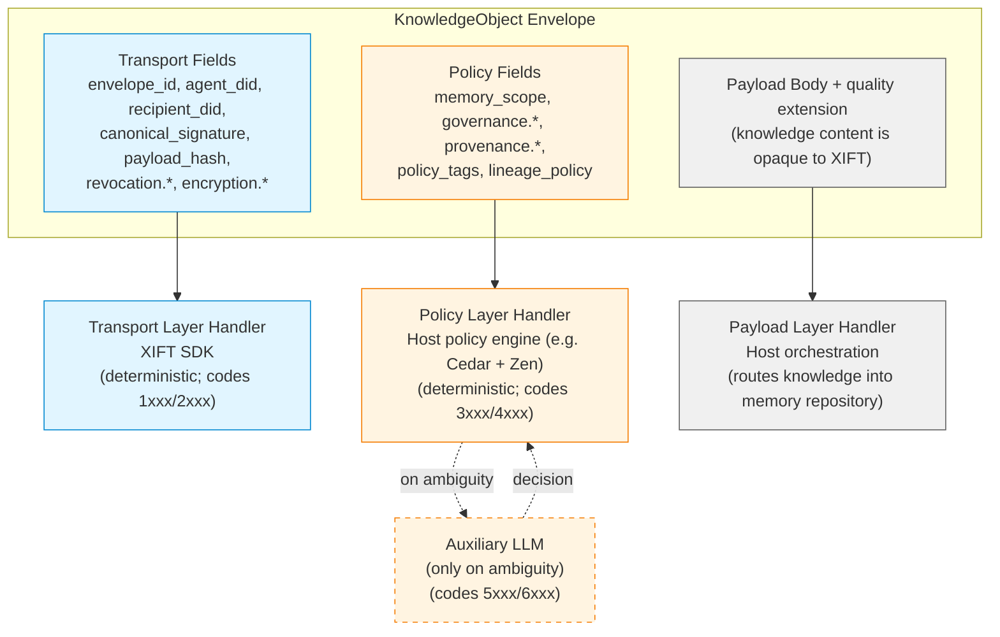
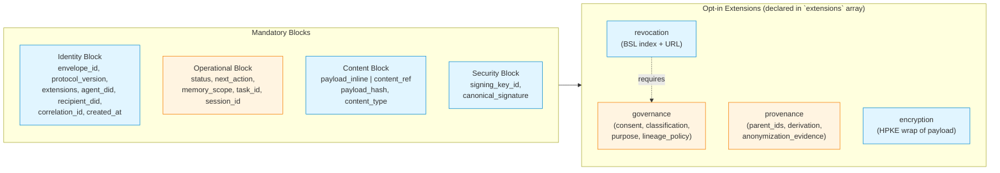
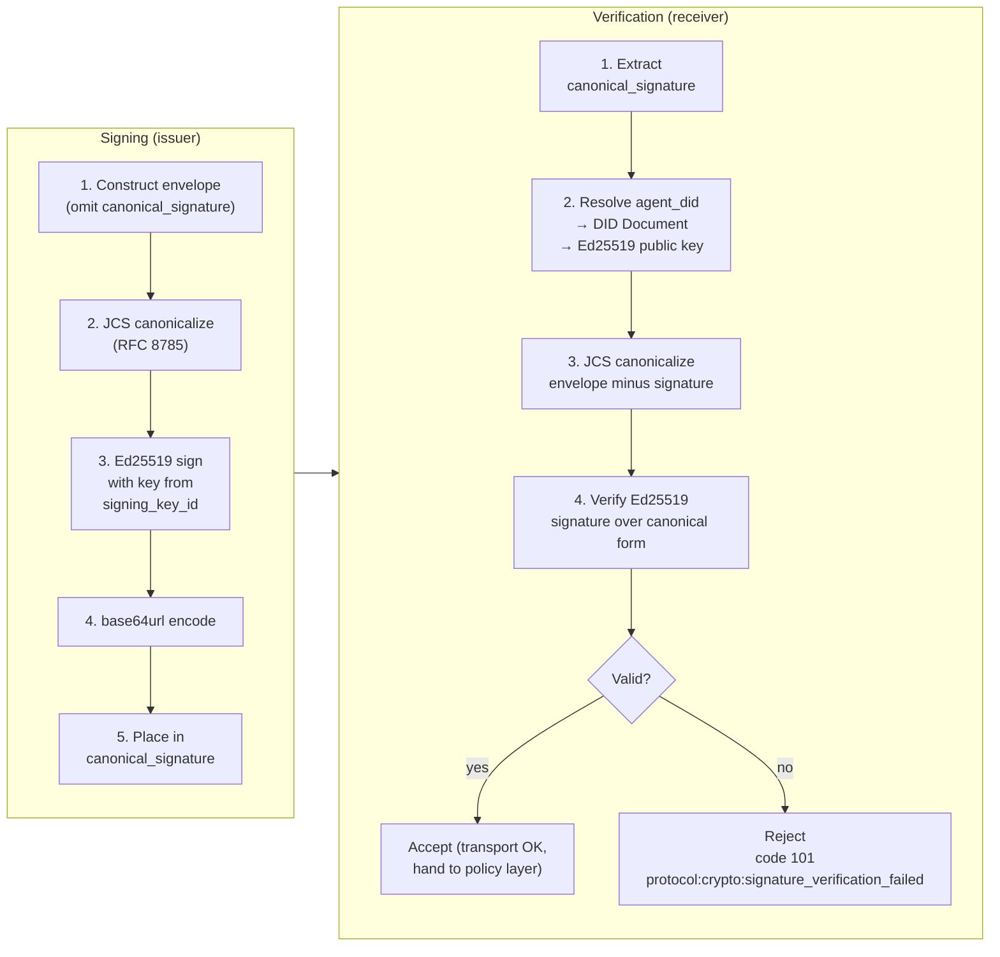
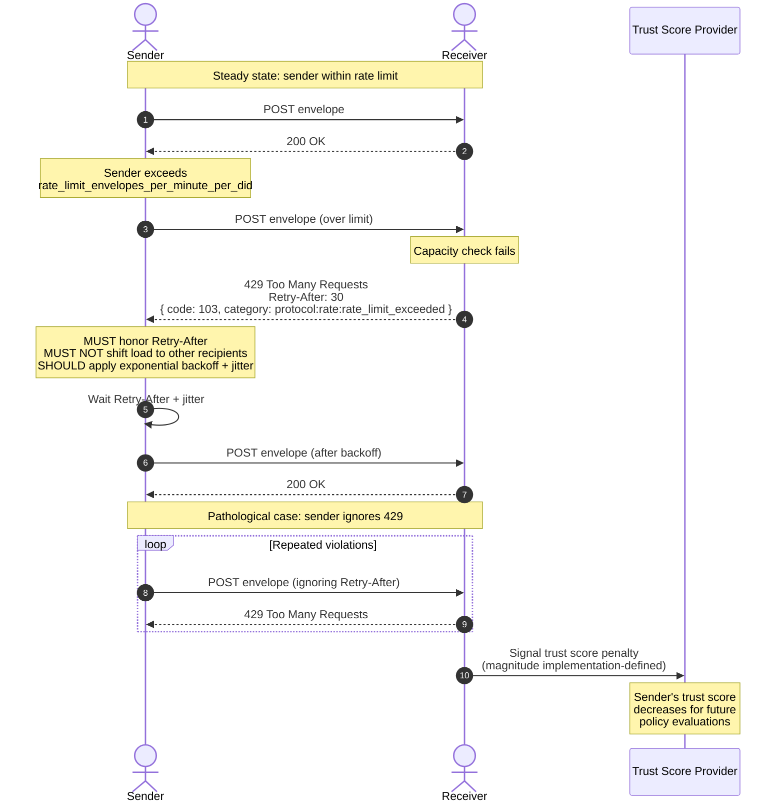

# XIFT 1.0 — Core Protocol Specification

## 0. Document Status

This document is **the XIFT v1.0 core protocol specification**: the
envelope, identity, signing, consent, revocation, error model,
transport fundamentals, normative parameters and anti-pattern
mitigations.

Companion specifications in separate documents:
- `xift-1.0-spec-channels-general.md` — cross-channel conventions
  (transport, authentication, back-pressure, identity handshake
  primitive, error code ranges, inter-channel flows, cross-channel
  anti-patterns, conformance tests).
- `xift-1.0-spec-channel-1.md` through `xift-1.0-spec-channel-7.md`
  — per-channel normative specifications (Discovery & Handshake,
  Envelope Handoff, Status Verification, Change Notification,
  Semantic Discovery Request/Response, Semantic Interest &
  Experience Announce, Sequential Conversation Session).
- `xift-custodian-1.0.md` — Trust Custodian role.
- `xift-interop-1.0.md` — adapters to A2A, MCP.

### 0.1 Paradigm: XIFT Exchanges *Knowledge*

XIFT is a protocol for the governed exchange of **knowledge**
between AI agents. The vocabulary of this document follows from
that paradigm:

- **Knowledge** is the matter that XIFT transports: facts,
  patterns, rules, summaries, observations and inferences that an
  agent has produced and that another agent can usefully consume.
- **Memory** is an agent's **internal repository** where knowledge
  is stored, organized and (maybe) decayed. The CoALA strata (working,
  episodic, semantic, procedural) are *strata of the memory
  repository*, not necessarily types of knowledge. The envelope's
  `memory_scope` field declares which stratum the knowledge
  belongs to inside the repository.
- **Experience** is one *kind* of knowledge: knowledge acquired
  during the operation of the agent's **Working Self** (the
  operational self executing tasks). Experiences start typically
  as episodic when fresh and may be distilled into semantic or
  procedural knowledge by lifecycle operations.
- An **envelope** (`KnowledgeObject`) is the unit of exchange. It
  carries a knowledge payload plus metadata required for governed
  delivery.

The protocol name **XIFT — eXperience Interchange for Federated
Trusts** retains "experience" because experience exchange was the
historical motivating use case; *knowledge* is the more general
substrate that the protocol carries, of which experience is one
kind.

### 0.2 Changes from v3.0

- Error model restructured into Error/Warning split per layer.
- Domain-specific terminology (clinical, financial) removed from
  canonical enums; used only as examples.
- Implementation-specific references (Agent Mesh, Cedar, Zen)
  repositioned as reference implementation choices, not protocol
  requirements.
- RBAC/ABAC integration: optional `agent_role` field added.
- DLP strengthening: egress validation, step-up authentication,
  metadata obfuscation for relays.
- Payload metadata (`quality_metrics`) split out as the `quality`
  extension, specified in `xift-1.0-spec-channels-general.md` §8.
- Paradigm clarification (§0.1): XIFT exchanges *knowledge*, of
  which *experience* is one kind; *memory* is the agent's internal
  repository. The canonical envelope is now named `KnowledgeObject`
  (was `MemoryObject`).

The key words "MUST", "MUST NOT", "REQUIRED", "SHALL", "SHALL NOT",
"SHOULD", "SHOULD NOT", "RECOMMENDED", "MAY", and "OPTIONAL" are
per RFC 2119 and RFC 8174.

---

## 1. Introduction

### 1.1 Design Principles

**Principle 1 — Governance and optimization of knowledge exchange.**
XIFT brings order, trust and stability to inter-agent knowledge
communication. Anything not governance or optimization of knowledge
handoff is out of scope.

**Principle 2 — Three layers, three handlers.** Transport is handled
deterministically by the SDK. Policy is handled by the host's policy
engine (with optional LLM auxiliary on genuine ambiguity). Payload is
opaque to XIFT and orchestrated by the host. These layers never
conflate.

**Principle 3 — XIFT does not classify content.** The issuer is the
sole authority on classification. XIFT carries declarations and
signatures, not inferences.

**Principle 4 — Independence from adjacent protocols and
implementations.** XIFT is not a subprotocol of A2A, MCP, or any
other protocol. XIFT does not mandate a specific DID method, policy
engine, or trust score provider. Adapters to adjacent protocols and
specific technology choices (identity providers, policy engines,
encryption libraries) are documented in `xift-interop-1.0.md` and
in reference implementations.

**Principle 5 — Fail closed.** Any verification, authorization or
identity failure results in denial, never permissive fallback.

### 1.2 What XIFT Is

XIFT (eXperience Interchange for Federated Trusts) is a
**peer-to-peer protocol for the governed exchange of knowledge
between AI agents**. The knowledge an agent exchanges originates
in its internal memory repository (working, episodic, semantic or
procedural strata) and includes experiences captured by the
agent's Working Self as well as facts, patterns and procedures it
has learned. XIFT provides:

- An **envelope format** (`KnowledgeObject`) carrying the knowledge
  artifact plus identity, operational, content and security
  metadata.
- A set of **opt-in extensions** (governance, provenance, encryption,
  revocation) that enrich the envelope when use cases require them.
- A **transport** based on HTTPS / Server-Sent Events.
- An **identity layer** based on W3C Decentralized Identifiers (DIDs).
- A **consent layer** based on Verifiable Credential–shaped grants
  with two-tier revocation (TTL + W3C Bitstring Status List).

### 1.3 What XIFT Is Not

- Does not apply policy. Authorization is the receiver's
  responsibility.
- Does not filter knowledge by memory stratum. The protocol
  transports knowledge originating from working, episodic, semantic
  and procedural memory strata; acceptance is receiver policy.
- Does not store knowledge. Storage is the agent's own memory
  repository concern.
- Does not classify knowledge content. The issuer declares
  classification; the receiver enforces it.
- Does not coordinate tasks.

### 1.4 Implementation Independence

XIFT is protocol-level. The following technology choices are made
by the **reference implementation** (Memgator + Agent Governance
Toolkit) but are NOT protocol requirements:

| Concern                  | Protocol Requirement                           | Reference Implementation                     |
| ------------------------ | ---------------------------------------------- | -------------------------------------------- |
| DID method               | Any W3C-compliant DID method                   | `did:mesh` (Microsoft Agent Mesh)            |
| Policy engine            | Any engine capable of ABAC evaluation          | Cedar (AWS) + Zen Engine (GoRules)           |
| Trust score provider     | Any system providing agent reputation (0–1000) | Agent Mesh Trust Score                       |
| Identity handshake       | Any mutual authentication protocol             | IATP (Agent Mesh Inter-Agent Trust Protocol) |
| E2EE key exchange        | Any X25519-compatible key agreement            | X3DH (Agent Mesh E2EE component)             |
| Sensitivity label source | Any external labelling system                  | Microsoft Purview, Google DLP, AWS Macie     |

Implementations using different technology stacks are conformant
provided they satisfy the protocol requirements column.

### 1.5 Positioning vs Adjacent Protocols

| Protocol         | Concern                              | Relationship to XIFT                              |
|------------------|--------------------------------------|---------------------------------------------------|
| MCP              | Tool use (vertical)                  | Orthogonal. Adapter in `xift-interop-1.0.md`.     |
| A2A              | Task negotiation (horizontal)        | Orthogonal. Adapter in `xift-interop-1.0.md`.     |
| DIDComm          | Generic secure messaging             | Not adopted. See §6.5.                            |
| W3C VC + BSL     | Credentials and revocation           | Substrate for governance + revocation extensions. |

---

## 2. The Three-Layer Model

### 2.1 Transport Layer (SDK)

Handled entirely by the XIFT SDK without host policy engine or LLM.
Covers envelope routing, identity verification (Ed25519 signature),
integrity (canonicalization, payload_hash), correlation
(`envelope_id`, `correlation_id`), encryption operations, and active
revocation checks (BSL pull).

Transport-layer processing is deterministic. Errors at this layer are
protocol-class (codes 1xxx). Warnings are codes 2xxx.

### 2.2 Policy Layer (Policy Engine + Auxiliary LLM)

Handled by the host's policy engine (ABAC-capable engine in the
reference implementation). Covers authorization decisions, sensitivity
and identifiability enforcement, purpose-of-use compliance, lineage
policy, retention enforcement, trust score thresholds, and role-based
access shortcuts.

Most policy decisions are deterministic. When the engine cannot
disambiguate, a bounded set of policy-relevant fields (typically 5–6)
is forwarded to an auxiliary LLM for arbitration. The LLM's decision
is enforced via the policy engine; the override is logged.

Policy-layer errors are codes 3xxx. Policy-layer warnings are codes
4xxx. Model-layer errors (LLM escalation) are codes 5xxx. Model-layer
warnings are codes 6xxx.

### 2.3 Payload Layer (Host Orchestration)

**Opaque to XIFT.** The host orchestrates how the knowledge payload
is incorporated into its internal memory repository.

The XIFT envelope is not designed for injection into an LLM's context
window. Only the payload (Layer 3) reaches the host's main LLM. The
auxiliary LLM (Policy Layer) sees only a bounded subset of Layer 2
fields when arbitration is needed.

Payload-adjacent metadata (quality metrics, profiling, confidence
scores) is addressed by the `quality` envelope extension, specified
in `xift-1.0-spec-channels-general.md` §8, not in this document.

### 2.4 Layer Field Distribution

| Field                                    | Layer        |
|------------------------------------------|--------------|
| `envelope_id`                            | Transport    |
| `protocol_version`                       | Transport    |
| `extensions`                             | Transport    |
| `agent_did`                              | Transport    |
| `recipient_did`                          | Transport    |
| `correlation_id`                         | Transport    |
| `created_at`                             | Transport    |
| `status`                                 | Transport    |
| `payload_inline` / `content_ref`         | Transport    |
| `payload_hash`                           | Transport    |
| `content_type`                           | Transport    |
| `signing_key_id`                         | Transport    |
| `canonical_signature`                    | Transport    |
| `revocation.*`                           | Transport    |
| `encryption.*`                           | Transport    |
| `next_action`                            | Policy       |
| `memory_scope`                           | Policy       |
| `task_id`                                | Policy       |
| `session_id`                             | Policy       |
| `governance.owner_did`                   | Policy       |
| `governance.agent_role`                  | Policy       |
| `governance.classification`              | Policy       |
| `governance.pii_classification`          | Policy       |
| `governance.purpose_of_use`              | Policy       |
| `governance.consent_vc_ref`              | Policy       |
| `governance.consent_vc_hash`             | Policy       |
| `governance.consent_until`               | Policy       |
| `governance.lineage_policy`              | Policy       |
| `governance.policy_tags`                 | Policy       |
| `provenance.*`                           | Policy       |
| (Payload body)                           | Payload      |

### 2.5 Three-Layer Model — Visual



The diagram shows that the envelope carries fields in three distinct
strata, each processed by a different handler. Layers never
conflate: transport fields never reach the policy engine, policy
fields never reach the host's main LLM except for quality extension, 
and payload content never reaches transport processing.

---

## 3. The KnowledgeObject Envelope

### 3.1 Canonical Form

The envelope is **flat JSON**, canonicalized per RFC 8785 (JCS).
Extension blocks are nested under their extension key, but the
envelope itself is not nested. There is no wrapping protocol (no
JSON-RPC, no JWM); the envelope IS the message.

The envelope's payload carries the **knowledge artifact**: any
serializable content the issuer wants a receiver to consume and
incorporate into its own memory repository. The envelope's
`memory_scope` field declares the stratum of the receiver's memory
repository this knowledge targets.

### 3.2 Single Format with Opt-in Extensions

XIFT defines **one** envelope format. Capabilities are negotiated by
implementations declaring `supported_extensions`. An envelope's
`extensions` array MUST be a subset of the receiver's supported
extensions; if not, `protocol:extension:unknown_extension` (code 105).

XIFT v1.0 defines **five** extensions, each specified in its own
companion document:

| Extension     | Spec document                                  | Purpose                                                |
|---------------|------------------------------------------------|--------------------------------------------------------|
| `governance`  | `xift-1.0-spec-extension-governance.md`        | Consent, classification, purpose of use, access policy. |
| `provenance`  | `xift-1.0-spec-extension-provenance.md`        | Derivation lineage and anonymization evidence.          |
| `encryption`  | `xift-1.0-spec-extension-encryption.md`        | End-to-end encryption of payload (HPKE).                |
| `revocation`  | `xift-1.0-spec-extension-revocation.md`        | Active revocation via W3C Bitstring Status List.        |
| `quality`     | `xift-1.0-spec-extension-quality.md`           | Payload-adjacent quality, confidence and profile.       |
| `ontology`    | `xift-1.0-spec-extension-ontology.md`          | Governed vocabulary descriptor and reciprocal alignment. |

The first four (`governance`, `provenance`, `encryption`,
`revocation`) are the **core extensions**: every conformant
implementation MUST recognise them (declare them in
`supported_extensions` or refuse envelopes that use them).
The fifth (`quality`) and sixth (`ontology`) are **silently
ignorable**: receivers that do not declare them MUST NOT reject
envelopes that carry them.

Combination rules (normative):

- `revocation` REQUIRES `governance`.
- `encryption` is REQUIRED when `governance.classification` is
  `sensitive` or `restricted`. Envelopes failing this are rejected
  (`protocol:encryption:mandatory_encryption_missing`, code 105).
- Other combinations are free.

### 3.3 Mandatory Blocks

#### 3.3.1 Identity Block

| Field              | Type    | Description                                              |
|--------------------|---------|----------------------------------------------------------|
| `envelope_id`      | ULID    | Unique identifier for this envelope.                     |
| `protocol_version` | SemVer  | XIFT version. v1: `"1.0"`.                               |
| `extensions`       | array   | Declared extensions. May be empty.                       |
| `agent_did`        | DID     | Emitting agent's DID.                                    |
| `recipient_did`    | DID     | Authorized recipient agent's DID.                        |
| `correlation_id`   | ULID    | OPTIONAL. `envelope_id` of the envelope this responds to.|
| `created_at`       | RFC3339 | UTC timestamp, millisecond precision.                    |

#### 3.3.2 Operational Block

| Field          | Type    | Description                                                 |
|----------------|---------|-------------------------------------------------------------|
| `status`       | enum    | `proposed`, `shipped`, `blocked`, `failed`.                 |
| `next_action`  | enum    | Hint: `store`, `promote`, `distill`, `discard`. Non-binding.|
| `memory_scope` | enum    | `working`, `episodic`, `semantic`, `procedural`.            |
| `task_id`      | string  | OPTIONAL. Receiver-domain task correlation.                 |
| `session_id`   | string  | OPTIONAL. Durable conversation identifier.                  |

#### 3.3.3 Content Block

Exactly one of `payload_inline` or `content_ref` MUST be present.

| Field            | Type    | Description                                                 |
|------------------|---------|-------------------------------------------------------------|
| `payload_inline` | string  | Base64-encoded payload. ≤ `payload_inline_size_max` (§10).  |
| `content_ref`    | URI     | Locator for out-of-band retrieval.                          |
| `payload_hash`   | string  | SHA-256 of canonical payload. REQUIRED with `content_ref`; OPTIONAL with `payload_inline`. See hash-string format below. |
| `content_type`   | string  | MIME or domain-specific type.                               |

##### Canonical Hash-String Format

Every hash-valued field across XIFT (`payload_hash`,
`consent_vc_hash`, `status_list_hash`, `aad_hash`,
`ciphertext_hash`, `derivation_method_hash`, and any
`anonymization_evidence` digest) uses the **prefixed lowercase-hex**
form:

```
sha256:<64 lowercase hexadecimal characters>
```

JSON-schema pattern: `^sha256:[a-f0-9]{64}$`. The algorithm prefix
is mandatory and lower-case; it leaves room for future
algorithm-agility (e.g., `sha384:`) without changing the field
type. Implementations MUST reject hash strings that do not match
this pattern.

Signature-valued fields (`canonical_signature`,
`query_signature`, `evaluation_signature`) are **base64url** of the
raw signature bytes — NOT the prefixed-hex form — because they carry
Ed25519 signatures, not digests.

#### 3.3.4 Security Block

| Field                  | Type    | Description                                          |
|------------------------|---------|------------------------------------------------------|
| `signing_key_id`       | string  | DID URL fragment identifying the signing key.        |
| `canonical_signature`  | string  | Base64url-encoded Ed25519 signature over JCS(envelope minus this field). |

#### 3.3.5 Envelope Composition — Visual



Blue blocks are transport-layer; orange blocks are policy-layer.
The `extensions` array of the Identity Block enumerates which
opt-in extensions are populated. The dashed dependency from
`revocation` to `governance` reflects the combination rule above.

### 3.4 Example: Minimal Envelope (No Extensions)

```json
{
  "envelope_id": "01HXX5VQ7K9M3J8N2P4R6T8WAY",
  "protocol_version": "1.0",
  "extensions": [],
  "agent_did": "did:key:z6MkhaXg...",
  "recipient_did": "did:key:z6MkiTBz...",
  "created_at": "2026-05-21T10:00:00.000Z",
  "status": "shipped",
  "next_action": "store",
  "memory_scope": "episodic",
  "payload_inline": "<base64-bytes>",
  "content_type": "application/json",
  "signing_key_id": "did:key:z6MkhaXg...#key-1",
  "canonical_signature": "<base64url-bytes>"
}
```

---

## 4. Extensions

XIFT v1.0 defines five envelope extensions; each is specified in
its own companion document. Those documents are **authoritative**
for the extension they describe; this section is an index.

| Extension     | Spec document                                  | Required to recognise? | Required by    |
|---------------|------------------------------------------------|------------------------|----------------|
| `governance`  | `xift-1.0-spec-extension-governance.md`        | Yes (core extension)   | All non-`public` envelopes. |
| `provenance`  | `xift-1.0-spec-extension-provenance.md`        | Yes (core extension)   | All envelopes with declared lineage. Strict-policy cascades depend on it. |
| `encryption`  | `xift-1.0-spec-extension-encryption.md`        | Yes (core extension)   | `governance.classification ∈ {sensitive, restricted}`. |
| `revocation`  | `xift-1.0-spec-extension-revocation.md`        | Yes (core extension)   | Envelopes whose grant is subject to active revocation. Requires `governance`. |
| `quality`     | `xift-1.0-spec-extension-quality.md`           | No (silently ignorable)| Never required. May accompany any envelope. |
| `ontology`    | `xift-1.0-spec-extension-ontology.md`          | No (silently ignorable)| Never required. May accompany any envelope; SHOULD on Channel 6. |

The four **core extensions** (`governance`, `provenance`,
`encryption`, `revocation`) are recognised by every conformant
implementation: each MUST appear (or be explicitly absent) in
`supported_extensions` of the capability advertisement
(`xift-1.0-spec-channel-1.md` §3, §4). An envelope using a core
extension that the receiver does not declare yields `protocol:extension:unknown_extension` (code 105).

The fifth (`quality`) and sixth (`ontology`) extensions are
**silently ignorable**: receivers that do not declare support MUST
NOT reject envelopes that carry them. See
`xift-1.0-spec-extension-quality.md` §4 and
`xift-1.0-spec-extension-ontology.md` §4.

Cross-extension combination rules are restated at §3.2 of this
document; per-extension behaviour, fields, error codes,
anti-patterns, conformance tests and open questions live in the
respective extension docs.

---

## 8. Identity Layer

### 8.1 Protocol Requirements for Identity

XIFT requires:

- Every participating agent has a **W3C-compliant DID**.
- The DID Document publishes at least one **Ed25519 signing key**.
- For encryption, the DID Document or a discoverable side-channel
  publishes at least one **X25519 key agreement key**.
- A **mutual authentication handshake** verifies peer identity before
  envelope exchange. The handshake SHOULD complete within 200 ms.
- A **trust score** (integer 0–1000) is available for each agent,
  consumable by the receiver's policy engine.

XIFT does NOT mandate a specific DID method, authentication protocol,
or trust score algorithm. The reference implementation uses
`did:mesh` (Microsoft Agent Mesh), IATP for handshake, and Agent Mesh
Trust Score, but conformant implementations may use `did:key`,
`did:web`, or any other W3C-compliant method with equivalent
primitives.

### 8.2 Three DIDs in Distinct Roles

| DID              | Role                                                       | Where                    |
|------------------|------------------------------------------------------------|--------------------------|
| `agent_did`      | The agent currently emitting this envelope.                | Identity block (required) |
| `recipient_did`  | The agent authorized to receive and process.               | Identity block (required) |
| `owner_did`      | The data subject (person, organization, entity).           | `governance` (optional)   |

A fourth DID, `derivation_agent_did`, appears in `provenance` when
the deriving agent differs from the emitting agent.

### 8.3 Signature Mechanics

```
1. Construct envelope with all fields except `canonical_signature`.
2. Apply JCS canonicalization (RFC 8785).
3. Compute Ed25519 signature (RFC 8032) using the key resolved via
   `signing_key_id`, which MUST be present in the DID Document
   of `agent_did`.
4. Base64url-encode the signature.
5. Place in `canonical_signature`.
```

Mermaid version (signing on the left, verification on the right):


Verification reverses the process. The signature covers the **entire
envelope including all extensions and ciphertext** (when `encryption`
is used). The signature commits to what is transmitted, not to
plaintext payload.

### 8.4 Egress Validation (DLP Requirement)

Before emitting an envelope, the sender MUST validate that the
`recipient_did` is authorized for the declared `classification`,
`pii_classification`, and `purpose_of_use`, based on the
`consent_vc`. This is **egress DLP**: preventing oversharing at
the point of origin, not only at the point of reception. Egress DLP 
is one of the pillars of XIFT protocol.

Implementations SHOULD log egress validation decisions in the
sender's audit trail. Envelopes emitted without egress validation
are non-conformant.

### 8.5 Identity Handshake

When XIFT initiates a session with a peer, it uses a mutual
authentication handshake to verify peer identity and trust score.
The handshake runs once per session; subsequent envelopes reuse the
verified channel via a session token. The 200 ms budget is an
operational target.

### 8.6 Step-up Authentication

When a receiver's policy engine determines that the declared
`classification` exceeds the current authentication assurance level
(e.g., `restricted` data arriving over a session established with
standard-assurance handshake), the receiver MAY respond with warning
a step-up condition (`policy:consent:additional_assurance_required`, code 207), requesting the sender to
re-authenticate with a higher assurance method before re-sending.

The specific mechanisms for step-up (multi-factor, hardware key,
biometric sponsor verification) are implementation-defined. XIFT
defines only the signalling mechanism (the warning code).

---

## 9. Lineage Rules

### 9.1 Lax Default

When the receiver derives a new artifact from a received one, the
derivative is sovereign by default: signed by the deriving agent,
independent revocation state.

### 9.2 Strict Override

When `governance.lineage_policy: strict`, derivatives inherit
revocation: they carry the source's `revocation` reference and are
invalidated when the source's BSL bit flips.

### 9.3 GDPR-Driven Strictness

`strict` is MANDATORY when `pii_classification ∈
{personal-identifiable, pseudonymized}`. Enforced at construction
(`protocol:lineage:lineage_policy_inconsistent`, code 105) and acceptance (same category).

### 9.4 Anonymization as State Transition

A deriving agent transitions from `personal-identifiable` or
`pseudonymized` to `anonymized` via:

- `provenance.anonymization_evidence` documenting method.
- New `pii_classification: anonymized`.
- New `lineage_policy: lax`.

The `anonymization_evidence` sub-object is normatively specified in
`xift-1.0-spec-extension-provenance.md` §3.2. Canonical shape:

```json
{
  "anonymization_evidence": {
    "method": "k-anonymity",
    "method_parameters": { "k": 5 },
    "evaluator_did": "did:web:evaluator.example.com",
    "evaluation_timestamp": "2026-05-21T09:30:00Z",
    "evaluation_signature": "<base64url-encoded Ed25519 signature>"
  }
}
```

Recognised `method` identifiers (extensible enum):

- `k-anonymity`, `differential-privacy`, `synthetic-generation`,
  `aggregation-only`, `llm-distillation-verified`.

Method-specific parameters live in `method_parameters` (e.g.,
`{ "k": 5 }` for `k-anonymity`, `{ "epsilon": 0.5 }` for
`differential-privacy`, `{}` for parameterless methods such as
`aggregation-only`).

`evaluator_did` and `evaluation_signature` are REQUIRED;
`evaluation_timestamp` is OPTIONAL (RECOMMENDED for regulatory audit
trails). The signature is Ed25519 over the JCS-canonical form of
`{envelope_id, method, method_parameters, evaluator_did,
evaluation_timestamp?}` per §8.3, providing non-repudiable
attestation; a bare hash would establish integrity without
authentication and is insufficient.

XIFT does not verify the anonymization itself; the receiver's
policy decides whether the evidence is sufficient (`policy:consent:additional_assurance_required`, code 207 on
rejection).

### 9.5 Cascade Implementation (Informative)

For `strict` lineage: source issuer maintains BSL; derivatives
reference source's BSL; on revocation all derivatives reachable via
`parent_ids` index are invalidated. Lineage queries are
receiver-storage concerns, not XIFT normative channels.

---

## 10. Normative Parameters

Recommended defaults. Implementations MAY adjust but MUST document
deviations. Conformance tests use defaults.

| Parameter                                 | Default | Layer      | Purpose                                                                        |
| ----------------------------------------- | ------- | ---------- | ------------------------------------------------------------------------------ |
| `transport_header_size_max`               | 8 KB    | Transport  | Total Identity + Operational + Security blocks.                                |
| `policy_block_size_max`                   | 16 KB   | Policy     | Total governance + provenance + revocation.                                    |
| `payload_inline_size_max`                 | 64 KB   | Payload    | Above this, use `content_ref`.                                                 |
| `lineage_chain_max`                       | 10      | Provenance | Max recursive depth of `parent_ids`.                                           |
| `policy_tags_count_max`                   | 16      | Policy     | Max `policy_tags` entries.                                                     |
| `native_labels_count_max`                 | 32      | Policy     | Max total `native_labels` label records across all schemes (governance §3.10). |
| `native_labels_bytes_max`                 | 4096    | Policy     | Max serialized size of the `native_labels` value (governance §3.10).           |
| `extensions_count_max`                    | 8       | Transport  | Max declared extensions (currently 6 defined: 4 core + `quality` + `ontology`; room for 2). |
| `mesh_p2p_hard_limit`                     | 50      | Mesh       | Max agents in P2P mesh without Trust Custodian. Hard limit.                    |
| `mesh_custodian_activation_threshold`     | 25      | Mesh       | Agent count at which custodian-eligible agents MUST activate.                  |
| `mesh_custodian_deactivation_threshold`   | 15      | Mesh       | Deactivation with hysteresis to prevent flapping.                              |
| `identity_handshake_cache_ttl_seconds`    | 900     | Identity   | TTL for identity handshake cache.                                              |
| `bsl_min_length_bits`                     | 131072  | Revocation | W3C BSL minimum for herd privacy.                                              |
| `bsl_max_staleness_seconds`               | 300     | Revocation | Max age of cached BSL.                                                         |
| `correlation_id_max_age_seconds`          | 3600    | Transport  | Max age for correlation_id replay protection.                                  |
| `rate_limit_envelopes_per_minute_per_did` | 60      | Transport  | Per-DID sustained rate limit.                                                  |
| `rate_limit_burst_per_did`                | 10      | Transport  | Burst capacity above sustained rate.                                           |

---

## 11. Back-Pressure (MUST)

Back-pressure is **mandatory**, not advisory.

### 11.1 Rate Limit Response

When a receiver exceeds capacity:

```
HTTP 429 Too Many Requests
Retry-After: 30

{
  "code": 103,
  "layer": "protocol",
  "severity": "error",
  "category": "rate_limit_exceeded",
  "machine_message": "Sender exceeded rate_limit_envelopes_per_minute_per_did=60",
  "retry_after_seconds": 30,
  "envelope_id": "01HXX..."
}
```

### 11.2 Sender Behaviour

- MUST honor `Retry-After`.
- MUST NOT increase rate to other recipients to compensate.
- SHOULD apply exponential backoff with jitter after repeated 429s.

### 11.3 Trust Score Penalty

Receivers MAY signal trust score penalty to senders that repeatedly
ignore 429. XIFT does not mandate specific penalty magnitudes.

### 11.4 Back-Pressure Flow — Visual



The diagram captures three regimes: the well-behaved interaction
(envelope accepted), the back-pressure regime (sender hits the cap,
honors `Retry-After`, resumes), and the pathological regime where
the sender ignores back-pressure and the receiver propagates a
trust score penalty signal upstream to the identity provider.

### 11.5 Worker Separation (Implementation Note)

Implementations are RECOMMENDED to separate:
- Envelope handoff queue
- Audit stream queue
- Change notification stream
- Status verification cache

---

## 12. Error Model

### 12.1 Error/Warning Split

XIFT errors and warnings are classified along three orthogonal axes:
a small, immutable **numeric code** (the deterministic routing axis),
a **layer**, and a **severity**. Domain-specific meaning lives in the
string `category` field (§12.2), not in the numeric code. This is the
hybrid model fixed by **ADR-XIFT-ERROR-MODEL-001**.

| Layer      | Code range | Handler                                                |
| ---------- | ---------- | ------------------------------------------------------ |
| (OK)       | 0          | Accepted, no condition.                                |
| `protocol` | 100–199    | SDK. Automatic retry / fallback.                       |
| `policy`   | 200–299    | Host policy engine. Deterministic resolution.          |
| `model`    | 300–399    | Auxiliary LLM. Ambiguous / ontological scenarios.      |
| `custom`   | 900–999    | Deployment-specific; not interoperable.                |
| RESERVED   | 400–899, 1000+ | Future layers. Require a superseding ADR.          |

Each layer owns a small set (≈10–15) of **generic operational codes**.
There is **no per-domain numeric block**: the numeric `financial` layer
that earlier drafts reserved (7000–8999) is **removed**; financial,
billing, clinical, and other vertical concerns are expressed in the
`category` namespace over a generic layer (e.g. `policy:financial:*`).
There are **no per-channel or per-Custodian numeric sub-ranges**: the
channel or extension is encoded in the `category` `domain` segment
(e.g. `protocol:channel3:…`), not in the number.

Canonical `protocol` codes: 
- `101 auth_failed`
- `102 invalid_argument`
- `103 rate_limit_exceeded`
- `104 not_found`
- `105 failed_precondition`
- `106 unavailable`
- `107 deadline_exceeded`
- `108 resource_exhausted`
- `109 aborted`
- `110 internal`
- `111 unimplemented`
- `112 version_unsupported`

Canonical `policy` codes: 
- `201 unauthorized,`
- `202 limit_exhausted`
- `203 precondition_failed`
- `204 data_protection_violation`
- `205 scope_not_accepted`
- `206 trust_below_threshold`
- `207 consent_invalid`

Canonical `model` codes:
- `301 ambiguous_context`
- `302 unmapped_ontology`
- `303 confidence_low`

**Severity is orthogonal to code.** The same code may carry either
severity; `severity` alone determines the outcome:

- **`error`**: envelope is REJECTED. The sender MUST NOT consider the
  envelope delivered.
- **`warning`**: envelope is ACCEPTED, but the receiver flags a
  condition. The sender MAY take corrective action on future envelopes.

A router resolves the operational family from `code`, the outcome from
`severity`, and the exact condition from `category`. There are no
warning sub-bands and no special "advisory" code.

### 12.2 Error/Warning Structure

```json
{
  "code": 205,
  "layer": "policy",
  "severity": "error",
  "category": "policy:scope:memory_scope_not_accepted",
  "machine_message": "memory_scope=procedural rejected by policy 'no-procedural-cross-agent'",
  "human_message": null,
  "context": {
    "rejectedScope": "procedural",
    "policyName": "no-procedural-cross-agent",
    "acceptedScopes": "working,episodic,semantic"
  },
  "remediation_paths": [
    {
      "type": "action",
      "label": "Request policy review",
      "uri": "",
      "action": "request_policy_review"
    }
  ],
  "envelope_id": "01HXX...",
  "correlation_id": null,
  "timestamp": "2026-05-21T10:00:00Z",
  "retryable": false,
  "retry_after_seconds": null
}
```

The error object is **flat** (one nesting level, scalar fields inside
`context` and `remediation_paths`) and is signed in full per
**ADR-XIFT-ERROR-SIGNING-001** (§9, JCS / Ed25519). The signature
covers `category`, `machine_message`, `human_message`, `context`, and
`remediation_paths`; only the outer `sig` member is unsigned.

| Field                 | Description                                                                                                                     |
| --------------------- | ------------------------------------------------------------------------------------------------------------------------------- |
| `code`                | Integer from the canonical per-layer set (§12.1). Routing axis; never carries domain meaning.                                   |
| `layer`               | `protocol` / `policy` / `model` / `custom`.                                                                                     |
| `severity`            | `error` (rejected) / `warning` (accepted with flag). Orthogonal to `code`.                                                      |
| `category`            | `layer:domain:sub_category` namespaced string (§12.5). Source of domain truth; registered in `xift-error-taxonomy.md`.          |
| `machine_message`     | Structured, parseable, NO PII. ALWAYS present.                                                                                  |
| `human_message`       | Natural language. Typically present when `layer == model`. MUST NOT contain PII, DIDs other than receiver's own, or payload details. |
| `context`             | Optional flat map of key → scalar (string/number/bool); one level, no nesting. State snapshot for remediation. Keys fold units (e.g. `limitPerMinute`). |
| `remediation_paths`   | Optional array of `{type, label, uri, action}` objects. Signed (ADR-XIFT-ERROR-SIGNING-001).                                    |
| `envelope_id`         | The envelope this refers to.                                                                                                    |
| `correlation_id`      | Echoed from original if present.                                                                                                |
| `timestamp`           | RFC3339 of generation.                                                                                                          |
| `retryable`           | Whether retry could succeed. Top-level routing primitive.                                                                       |
| `retry_after_seconds` | Suggested wait when `retryable=true`. Top-level routing primitive.                                                              |

The `remediation_hints` array of earlier drafts is superseded by the
structured `remediation_paths` array.

### 12.3 Layer Routing

- `protocol` errors/warnings: handled by SDK. Surfaced to caller
  only on terminal failure.
- `policy` errors/warnings: returned to host SDK; deterministic
  resolution.
- `model` errors/warnings: passed to auxiliary LLM with
  `human_message` context. LLM decides next step.
- `custom`: per deployment.

### 12.4 Configurable Thresholds

XIFT does not mandate frequency ceilings. Implementations MAY
configure in `xift.toml`:

```toml
[error_thresholds]
model_layer_warning_percent = 5
model_layer_critical_percent = 20
window_seconds = 3600
```

### 12.5 Error Catalog and Category Registry

The numeric routing codes are the canonical per-layer sets enumerated
in §12.1. This spec does **not** enumerate every domain category; the
authoritative, versioned catalog of `category` values is
`xift-error-taxonomy.md` (the **category registry**, IANA-style). New
categories are added to the registry **without a wire change**, since
the wire carries only the numeric `code`, `layer`, `severity`, and the
`category` string.

#### Category grammar

```
category      := layer ":" domain ":" sub_category
layer         := "protocol" | "policy" | "model" | "custom"
domain        := segment                      ; channel, extension, or topic
sub_category  := segment ( ":" segment )*     ; preserved verbatim names allowed
segment       := [a-z] [a-z0-9_]*             ; lower_snake
```

- `domain` encodes the channel or extension when relevant
  (`channel1`…`channel7`, `governance`, `provenance`, `encryption`,
  `revocation`, `quality`, `custodian`) or a cross-cutting topic
  (`crypto`, `rate`, `transport`, `version`, `scope`, `trust`,
  `financial`, `gdpr`, `memory`, …).
- Protocol-stable names are preserved verbatim as `sub_category`:
  `policy:scope:memory_scope_not_accepted`; CoALA strata
  `model:memory:working|episodic|semantic|procedural`; GDPR vocabulary
  verbatim.
- Financial / billing semantics are `policy:financial:*` — there is no
  numeric financial layer.

#### Example categories

| `code` | `severity` | `category`                                      |
|--------|------------|-------------------------------------------------|
| 101    | error      | `protocol:crypto:signature_verification_failed` |
| 102    | error      | `protocol:crypto:canonicalization_failed`       |
| 112    | error      | `protocol:version:unsupported_protocol_version` |
| 103    | error      | `protocol:rate:rate_limit_exceeded`             |
| 107    | error      | `protocol:transport:transport_timeout`          |
| 105    | error      | `protocol:channel3:bsl_too_short`               |
| 205    | error      | `policy:scope:memory_scope_not_accepted`        |
| 206    | error      | `policy:trust:trust_score_below_threshold`      |
| 202    | error      | `policy:financial:payment_required`             |
| 301    | error      | `model:classification:ambiguous_classification` |

A warning reuses the operational `code` of its family with
`severity=warning` (e.g. `106` / `warning` /
`protocol:channel3:bsl_cache_near_expiry`).

---

## 13. Anti-Patterns and Mitigations

### 13.1 Query Storms

Popular agents become attractors of queries, saturating resources.

**Mitigation:** Per-DID rate limits (§10), back-pressure as MUST
(§11), Trust Custodian as fan-out controller above 50 agents
(see `xift-custodian-1.0.md`), `mesh_p2p_hard_limit` prevents
storm scenarios in P2P.

### 13.2 Poisoning of Semantic Indices

Adversarial agents publish inflated capability vectors.

**Mitigation:** Capability advertisements (`xift-1.0-spec-channel-1.md` §4)
MUST be signed. Trust score gating. Liveness checks via identity
handshake.

### 13.3 Cold-start Semantic Routing

New agents with novel capabilities remain underutilized.

**Mitigation:** Custodian bootstraps new agents into index
(see `xift-custodian-1.0.md`). Trust score default 500 provides
baseline acceptance.

### 13.4 LLM Cost Runaway

LLM on every routing decision is prohibitive (48.5% token reduction
demonstrated by selective routing, "When to Reason", Oct 2025).

**Mitigation:** Three-layer model (§2): LLM only for model-layer
codes. Semantic Router in the SDR channel
(`xift-1.0-spec-channel-5.md`). Configurable thresholds (§12.4).

### 13.5 Embedding Lock-in

Fixing a specific embedding model creates migration friction.

**Mitigation:** Capability vectors (`xift-1.0-spec-channel-1.md` §4.3)
carry `model` and `dimensions` fields. Multiple embeddings per
artifact allowed. Protocol wire format never fixes embedding scheme.

### 13.6 Eclipse Attacks

Attacker controls the peers an agent sees.

**Mitigation:** Multi-Custodian topology (see `xift-custodian-1.0.md`).
Identity handshake verifies cryptographically, not by network
position. Trust score propagation detects behavioural changes.

### 13.7 Privacy Leaks via Query Content

Thematic queries expose sensitive details to untrusted peers.

**Mitigation:** Egress validation (§8.4) before any envelope leaves.
Policy engine can require anonymized embeddings for queries to
low-trust peers. BSL herd privacy (§7.3) for revocation checks.
Governance metadata MAY be obfuscated (hashed) when transiting
through untrusted relays — the receiver decrypts using the shared
session key. Detailed mechanism deferred to a future relay
specification ADR.

### 13.8 Oversharing (DLP Egress)

Agents accidentally expose more knowledge than necessary.

**Mitigation:** Egress validation (§8.4) as normative MUST.
Sender's policy engine MUST verify recipient authorization against
`consent_vc` before emission. Semantic query scoping
(`xift-1.0-spec-channel-5.md` §10, SDR Egress Obligations) limits
search results to authorized fragments.

### 13.9 Fanout Explosion (Federated System Lesson)

Mastodon-style fan-out with no back-pressure collapses under load.

**Mitigation:** Back-pressure MUST (§11). Metadata-only replication:
payloads transfer via `content_ref` on demand. Custodian controls
fan-out above 50 agents.

### 13.10 State Explosion (Federated System Lesson)

Monolithic event persistence bottlenecks on cardinality growth.

**Mitigation:** Worker separation RECOMMENDED (§11.5).
`lineage_chain_max = 10`. `extensions_count_max = 8`.

### 13.11 Relay Centralization (Federated System Lesson)

Few large relays accumulate traffic and concentrate power.

**Mitigation:** Multi-Custodian from day one (see
`xift-custodian-1.0.md`). Custodian role can be split across
multiple agents (discovery, BSL, cache). Trust score gating drops
misbehaving Custodians.

---

## 14. Transport

### 14.1 HTTPS/SSE as Base

All XIFT channels run over HTTPS. JSON bodies. SSE for streams.
HTTP/2 RECOMMENDED for multiplexing.

### 14.2 TLS Requirements

| Scenario                                          | TLS Required? |
|---------------------------------------------------|---------------|
| Cross-host communication (any classification)     | Yes, TLS 1.3+ |
| Same-host IPC, classification ≤ internal          | Optional      |
| Same-host IPC, classification ≥ confidential      | Yes           |
| Dial-back endpoint serving                        | Yes, TLS 1.3+ |

### 14.3 Dial-Back

When `content_ref` is used:

```
GET /xift/v1/artifacts/{artifact_id}
Authorization: Signature <signed-challenge>
```

Issuer verifies requester is `recipient_did`, challenge signature
fresh (≤ 60 s), returns payload. TTL ≤ 5 minutes enforced.

### 14.4 File-Based Transport (Implementation Note)

`content_ref` may be `file://`, `s3://`, `gs://`, `azure://` in
shared-storage deployments. Envelope SHOULD be encrypted at rest
unless deployment audits content for non-sensitive use. Deployer's
discretion.

---

## 15. Cryptography

| Operation                  | Algorithm                                           |
|----------------------------|-----------------------------------------------------|
| Envelope canonicalization  | RFC 8785 (JCS)                                      |
| Envelope signing           | Ed25519 (RFC 8032)                                  |
| Payload hashing            | SHA-256                                             |
| Payload encryption         | HPKE-X25519-SHA256-AES256GCM (RFC 9180) — default   |
| Transport encryption       | TLS 1.3 (RFC 8446)                                  |

### 15.1 Post-Quantum Signatures

ML-DSA-65 is available in some DID methods. XIFT v1.0 does not adopt
it yet. Migration follows the identity provider's lead via amendatory
ADR. No envelope structure changes anticipated.

---

## 16. Threat Model

### 16.1 Adversaries

1. **Malicious peer** — Forges envelopes, replays grants.
2. **Compromised relay** — Modifies, drops, or duplicates envelopes.
3. **Curious mesh node** — Infers content from metadata/timing.
4. **Compromised receiver** — Acts outside declared `purpose_of_use`.
5. **Mis-classifying issuer** — Under-declares sensitivity.
6. **Adversarial capability advertiser** — Inflated capabilities
   (see Channel 1, `xift-1.0-spec-channel-1.md` §9).
7. **Oversharing sender** — Accidentally exposes more data than
   authorized.

### 16.2 Prevented

| Threat                          | Mechanism                                         |
|---------------------------------|---------------------------------------------------|
| Envelope forgery                | Ed25519 signature verification                    |
| Unauthorized access             | Grant verification + recipient match              |
| Replay                          | `envelope_id` uniqueness + TTL + handshake nonces |
| Tampering in transit            | TLS + envelope signature                          |
| Stale revocation                | BSL `max_staleness_seconds` fail-closed           |
| Lineage downgrade (PII to lax)  | `protocol:lineage:lineage_policy_inconsistent` (105) |
| Oversharing at origin           | Egress validation (§8.4)                          |
| Step-up bypass                  | `policy:consent:additional_assurance_required` (207) |

### 16.3 Detected but Not Prevented

| Threat                                       | Detection                              |
|----------------------------------------------|----------------------------------------|
| Purpose-of-use violation                     | Audit trail + lineage tags             |
| Mis-classification by issuer                 | Audit + downstream review              |
| Key compromise                               | BSL update + DID rotation              |
| Governance metadata inference via relay       | Obfuscation (§13.7), future relay ADR     |

### 16.4 Out of Scope for v1.0

- Confidentiality from compromised receiver (requires TEE).
- Sybil at identity layer (delegated to trust score provider).
- Multi-tenant federation (deferred to a future XIFT version).
- Multi-agent MLS E2EE (deferred to a future XIFT version).

---

## 17. Open Questions

1. **Encryption key standardization.** Path to including X25519 keys
   natively in W3C DID Documents is open.
2. **Versioning between XIFT core and host reference implementation.**
   Needed for the Memgator MemoryHost adapter.
3. **Multi-recipient envelopes.** Deferred.
4. **PAX convergence.** Shared handoff abstraction, v2 conversation.
5. **Post-quantum signature adoption timing.**
6. **Inline threshold calibration.** 64 KB is working assumption.
7. **Role taxonomy registry.** Should XIFT publish a recommended
   (non-mandatory) taxonomy of `agent_role` values?
8. **Governance metadata obfuscation for relays.** Detailed mechanism
   deferred to a future relay specification ADR.

---

## Appendix A — Comparison with Adjacent Protocols

| Concern              | MCP        | A2A          | DIDComm        | **XIFT**         |
|----------------------|------------|--------------|----------------|------------------|
| Layer                | tool       | task         | messaging      | knowledge        |
| Direction            | vertical   | horizontal   | bidirectional  | peer-to-peer     |
| Identity             | endpoint   | endpoint     | DID            | DID              |
| Envelope             | RPC        | JSON-RPC 2.0 | JWM nested     | flat JCS         |
| Consent              | none       | none         | implicit       | VC + BSL (ext)   |
| Lineage              | n/a        | n/a          | thread         | DAG (ext)        |
| RBAC/ABAC            | none       | none         | none           | ABAC + optional RBAC |
| Egress DLP           | none       | none         | none           | MUST (§8.4)      |
| Back-pressure        | impl-spec  | impl-spec    | impl-spec      | MUST             |
| Integration          | SDK + svr  | SDK + svr    | SDK            | SDK + svr        |

---

## Appendix B — Conformance Test Categories

| Suite | Name                              | Description                                         |
|-------|-----------------------------------|-----------------------------------------------------|
| C1    | Envelope round-trip               | Sign, transmit, verify; tamper, expect rejection.   |
| C2    | JCS canonicalization invariance   | Same envelope, different serializations, same sig.  |
| C3    | Grant lifecycle                   | TTL expiry; BSL revocation; combined.               |
| C4    | Extension capability negotiation  | Unsupported extension → `protocol:extension:unknown_extension` (105).                       |
| C5    | Dial-back                         | Valid/invalid recipient signatures.                 |
| C6    | Lineage lax + strict              | Lax: no cascade. Strict: cascade. Downgrade: `protocol:lineage:lineage_policy_inconsistent` (105).  |
| C7    | Classification fail-safes         | Missing `pii_classification` defaults to personal.  |
| C8    | Encryption mandate                | Sensitive/restricted without encryption → `protocol:encryption:mandatory_encryption_missing` (105).     |
| C9    | Error/warning routing             | Errors reject, warnings accept.                     |
| C10   | Anonymization evidence            | Strict→lax with/without evidence.                   |
| C11   | Back-pressure                     | 429 + Retry-After; sender honors backoff.           |
| C12   | Parameter enforcement             | Each §10 parameter enforced correctly.              |
| C13   | Egress validation                 | Sender validates recipient before emission.         |
| C14   | Step-up authentication            | `policy:consent:additional_assurance_required` (207) triggers re-auth flow.                 |

---

## Appendix C — Example Envelopes

### C.1 Minimal Episode (No Extensions)

See §3.4.

### C.2 Sensitive Episode (Governance + Encryption + Revocation)

```json
{
  "envelope_id": "01HXX5VQ7K9M3J8N2P4R6T8WBZ",
  "protocol_version": "1.0",
  "extensions": ["governance", "encryption", "revocation"],
  "agent_did": "did:web:org.example.com:agent:clinical-1",
  "recipient_did": "did:web:org.example.com:agent:summarizer-2",
  "correlation_id": "01HXX5VQ7K9M3J8N2P4R6T8WAA",
  "created_at": "2026-05-21T10:05:00.000Z",
  "status": "shipped",
  "next_action": "distill",
  "memory_scope": "episodic",
  "task_id": "consult-2026-05-21-447",
  "session_id": "sess-01HXX...",
  "content_ref": "https://agent-clinical-1.example.com/xift/v1/artifacts/01HXX...",
  "payload_hash": "sha256:a3f2...",
  "content_type": "application/json",
  "signing_key_id": "did:web:org.example.com:agent:clinical-1#key-1",
  "canonical_signature": "<base64url-bytes>",
  "governance": {
    "owner_did": "did:web:org.example.com:subject:p-12345",
    "agent_role": "clinical-analyst",
    "classification": "sensitive",
    "pii_classification": "personal-identifiable",
    "purpose_of_use": "service-delivery",
    "consent_vc_ref": "https://org.example.com/grants/g-7788",
    "consent_vc_hash": "sha256:b1c4...",
    "consent_until": "2026-05-21T11:05:00Z",
    "lineage_policy": "strict",
    "policy_tags": ["no-share-outside-trust", "audit-required"]
  },
  "encryption": {
    "scheme": "hpke-x25519-sha256-aes256gcm",
    "recipient_kid": "did:web:org.example.com:agent:summarizer-2#enc-key-1",
    "ephemeral_pubkey": "<base64>",
    "nonce": "<base64>",
    "aad_hash": "sha256:c2d3...",
    "ciphertext_hash": "sha256:e4f5..."
  },
  "revocation": {
    "status_list_url": "https://org.example.com/bsl/list-2026-05",
    "status_list_index": 47291,
    "status_list_hash": "sha256:f6a7...",
    "max_staleness_seconds": 60
  }
}
```

### C.3 Anonymized Semantic Distillation (Strict→Lax)

```json
{
  "envelope_id": "01HXX5VQ7K9M3J8N2P4R6T8WCC",
  "protocol_version": "1.0",
  "extensions": ["governance", "provenance"],
  "agent_did": "did:web:org.example.com:agent:summarizer-2",
  "recipient_did": "did:web:org.example.com:agent:research-3",
  "created_at": "2026-05-21T10:10:00.000Z",
  "status": "shipped",
  "next_action": "store",
  "memory_scope": "semantic",
  "task_id": "research-batch-099",
  "payload_inline": "<base64-bytes>",
  "content_type": "application/json",
  "signing_key_id": "did:web:org.example.com:agent:summarizer-2#key-1",
  "canonical_signature": "<base64url-bytes>",
  "governance": {
    "classification": "internal",
    "pii_classification": "anonymized",
    "purpose_of_use": "research",
    "consent_until": "2027-05-21T10:10:00Z",
    "lineage_policy": "lax",
    "policy_tags": ["model-training-prohibited"]
  },
  "provenance": {
    "parent_ids": ["01HXX5VQ7K9M3J8N2P4R6T8WBZ"],
    "derivation_type": "distillation",
    "stratum_in": "episodic",
    "stratum_out": "semantic",
    "derivation_agent_did": "did:web:org.example.com:agent:summarizer-2",
    "derivation_timestamp": "2026-05-21T10:09:55Z",
    "anonymization_evidence": {
      "method": "k-anonymity",
      "method_parameters": { "k": 5 },
      "evaluator_did": "did:web:org.example.com:evaluator:1",
      "evaluation_timestamp": "2026-05-21T10:09:50Z",
      "evaluation_signature": "<base64url-bytes>"
    }
  }
}
```

---

## Appendix D — Glossary

| Term                  | Meaning                                                          |
|-----------------------|------------------------------------------------------------------|
| Knowledge             | The substance XIFT exchanges: facts, patterns, rules, summaries, observations and inferences produced by an agent and consumable by another. |
| Knowledge artifact    | A concrete unit of knowledge wrapped in a `KnowledgeObject` envelope for exchange. |
| KnowledgeObject       | The canonical envelope of XIFT v1.0. The unit transmitted on the wire. (Predecessor name: `MemoryObject`.) |
| Memory (repository)   | An agent's internal repository where knowledge is stored, organized, and decayed. Distinct from the protocol; XIFT does not implement memory. |
| Memory stratum        | A subdivision of an agent's memory repository following CoALA: `working`, `episodic`, `semantic`, `procedural`. Declared by the envelope's `memory_scope` field. |
| Experience            | One kind of knowledge — knowledge acquired during the operation of the agent's Working Self. Typically lands in episodic or working strata. |
| Working Self          | The operational self of an agent executing tasks. The source of experiences. |
| Three-layer model     | Transport / Policy / Payload separation (§2).                    |
| Auxiliary LLM         | LLM for policy arbitration. NOT the host's main LLM.            |
| Trust Custodian       | Optional relay/aggregator, obligatory at mesh ≥ 50. See `xift-custodian-1.0.md`. |
| Issuer                | Agent creating and signing a `KnowledgeObject`.                  |
| Receiver              | Agent identified by `recipient_did`.                             |
| Egress validation     | Sender-side DLP check before emission (§8.4).                   |
| Step-up authentication| Re-auth with higher assurance for sensitive knowledge (§8.6).   |
| Strict lineage        | Revocation cascades to derivatives.                              |
| Lax lineage           | Derivatives are sovereign.                                       |
| Agent role            | RBAC-style shortcut for policy evaluation (§4.3).               |

---

## Appendix E — Change Log

> **Change history:** consolidated in [`spec/CHANGELOG.md`](./CHANGELOG.md) (newest first).

## Appendix F — Companion Documents

The XIFT v1.0 specification set comprises the following documents.
This core spec is the central reference; channel documents and
companions normatively extend or implement the primitives defined
here.

### Channel Specifications

- `xift-1.0-spec-channels-general.md` — cross-channel conventions,
  identity handshake as primitive, inter-channel flows, cross-
  channel anti-patterns, the `quality` envelope extension,
  conformance tests, and billing-related cross-channel error codes.
- `xift-1.0-spec-channel-1.md` — Discovery & Handshake.
- `xift-1.0-spec-channel-2.md` — Envelope Handoff.
- `xift-1.0-spec-channel-3.md` — Status Verification (BSL Pull).
- `xift-1.0-spec-channel-4.md` — Change Notification (Revocation Push).
- `xift-1.0-spec-channel-5.md` — Semantic Discovery Request/Response (SDR).
- `xift-1.0-spec-channel-6.md` — Semantic Interest & Experience Announce (SIEA).
- `xift-1.0-spec-channel-7.md` — Sequential Conversation Session (SCS).

### Companion Specifications

- `xift-custodian-1.0.md` — Trust Custodian role: activation
  thresholds, multi-Custodian topology, capability index hosting,
  BSL aggregation, identity handshake cache.
- `xift-interop-1.0.md` — adapters to A2A and MCP, payment rail
  adapter patterns.

### How the Core Spec Relates

This core spec defines the envelope, the three-layer model, the
identity layer, the lineage rules, the error model and the
normative parameters that every channel and companion document
builds on. Anti-pattern mitigations (§13) reference the channel
and Custodian documents where the actual mechanism lives; the core
spec carries the requirement, the companion carries the
implementation.

### Items Deferred Beyond v1.0

- Multi-agent MLS E2EE (RFC 9420) for group sessions.
- Multi-tenant federation patterns.
- Multi-recipient envelopes.
- Post-quantum signature migration (ML-DSA-65) once the identity
  provider supports it natively.
- Detailed relay specification for governance metadata obfuscation
  (§13.7).
